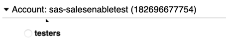

# Accessing the Environments

- [Get registered to use SAS resources](#get-registered-to-use-sas-resources)
- [Reserve a collection in RACE as a workspace](#reserve-a-collection-in-race-as-a-workspace)
- [Navigation](#navigation)

## Get registered to use SAS resources 

This workshop relies on resources which you must be registered and approved to use. 

1. If this is **your first time** using a GEL workshop to book a collection of VMs in RACE:

   * Follow the instructions to [register as a member of the STIC EXNET Users Group](https://gitlab.sas.com/GEL/workshops/PSGEL255-deploying-viya-4.0.1-on-kubernetes/-/blob/main/01_Introduction/01_031_Booking_a_Lab_Environment_for_the_Workshop.md#register-yourself-to-be-part-of-the-sticexnetusers-group).

2. Request access to the SAS-owned AWS account.

   * [Send this email](mailto:dlistadmin@wnt.sas.com?subject=SUBSCRIBE%20AWS-182696677754-testers) to join the **testers** role of the **sas-salesenabletest** account

   * It might take several minutes to process

   * Confirm by [logging on the AWS Console](http://go.sas.com/aws) using your SAS credentials (if prompted)

   * If you already are a member of other roles, then you'll be prompted to select which to AWS account/role to use. For this workshop, confirm you see (and choose):

     

## Reserve a collection in RACE as a workspace

We use virtual machines in the RACE environment for this workshop. 

1. [DEFAULT]: [Book the VMWare-based collection](http://race.exnet.sas.com/Reservations?action=new&imageId=333991&imageKind=C&comment=Viya%204%20-%20Single%20Machine&purpose=PST&sso=PSGEL297&schedtype=SchedTrainEDU&startDate=now&endDateLength=1) (№ 333991). This reservation is good for 1 day.

   [ALTERNATE] If the default VMWare collection isn't available, then [book the Azure-based collection](http://race.exnet.sas.com/Reservations?action=new&imageId=372700&imageKind=C&comment=%20GELLOW%20DEV%20Azure&purpose=PST&sso=PSGEL297&schedtype=SchedTrainEDU&startDate=now&endDateLength=0&discardonterminate=y) (№ 372700) instead. This reservation is limited to 4 hours. 

2. An email announcing the readiness of your collection and the machine hostnames will be sent to you. 

3. Access your RACE collection:
  
   * Use the **Microsoft Remote Desktop** software on your PC to connect to the Windows host in RACE (u: `.\Student`, pw: `Metadata0`)
   * Then, on the Windows host in RACE, open the **MobaXterm** app (look for its icon on the desktop) and connect to the `sasnode01` session with credentials (u: `cloud-user`, pw: `lnxsas`).

# End

You've gained access to the SAS-managed area of Amazon Web Services. And you've reserved and connected to your virtual machines in RACE.

## Navigation

<!-- startnav -->
* [00 001 Access Environments](/00_001_Access_Environments.md)**<-- you are here**
* [README](/README.md)
* [Track B-Automated / 03 510 Provision Resources](/Track-B-Automated/03_510_Provision_Resources.md)
* [Track B-Automated / 03 520 Deploy SAS Viya](/Track-B-Automated/03_520_Deploy_SAS_Viya.md)
* [Track B-Automated / 03 590 Cleanup Resources](/Track-B-Automated/03_590_Cleanup_Resources.md)
<!-- endnav -->
