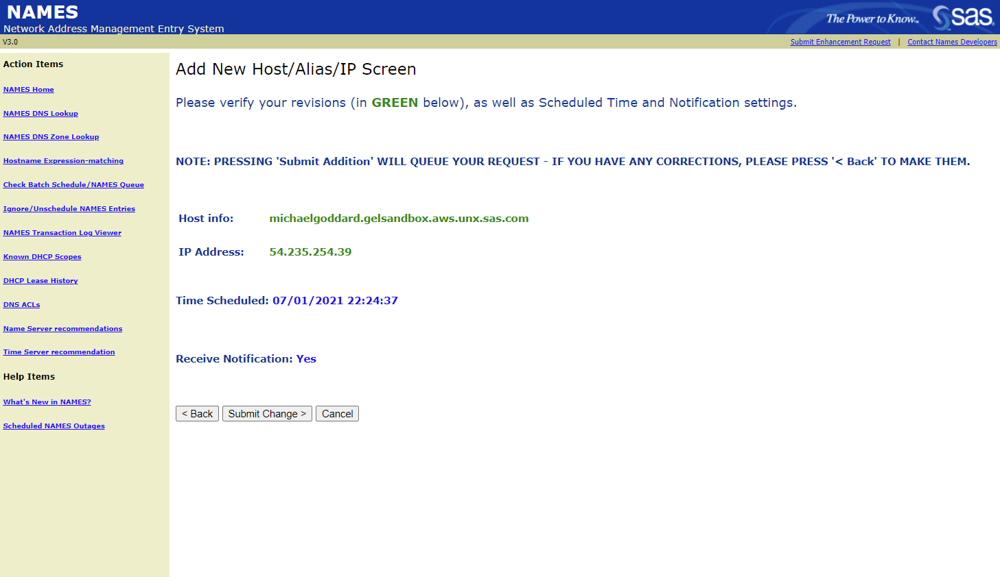

# Prepare the cluster for SAS Viya

**THIS EXERCISE IS STILL UNDER CONSTRUCTION**

**This has been initially created for use with the Deployment Operator exercises**

---

* [Introduction](#introduction)
* [Acquiring tools](#acquiring-tools)
* [Prepare the local machine](#prepare-the-local-machine)
* [Prepare the NFS directory structure in AWS](#prepare-the-nfs-directory-structure-in-aws)
* [Configure the deployment of SAS Viya](#configure-the-deployment-of-sas-viya)
  * [*Troubleshooting*](#troubleshooting)
* [Deploy SAS Viya pre-requisites](#deploy-sas-viya-pre-requisites)
* [Configure kubectl auto-completion](#configure-kubectl-auto-completion)
* [Define a DNS alias for the Ingress to SAS Viya](#define-a-dns-alias-for-the-ingress-to-sas-viya)
  * [Use the SAS NAMES Service to create a DNS alias](#use-the-sas-names-service-to-create-a-dns-alias)
* [Next Steps](#next-steps)
* [Complete Hands-on Navigation Index](#complete-hands-on-navigation-index)

## Introduction

We will use the [viya4-deployment project](https://github.com/sassoftware/viya4-deployment) available from SAS in Github to prepare the cluster for deploying the SAS Viya software.

## Acquiring tools

1. Clone the viya4-deployment project and build the Docker container [viya4-deployement](https://github.com/sassoftware/viya4-deployment) we'll use:

   ```bash
   # as cloud-user on your Linux host in RACE
   cd ~

   # clone the viya4-deployment repo
   git clone https://github.com/sassoftware/viya4-deployment

   cd ~/viya4-deployment

   # Build the viya4-deployment container
   docker build -t viya4-deployment .
   ```

2. Try running the viya4-deployment container

   ```bash
   # as cloud-user on your Linux host in RACE

   docker container run --rm -it viya4-deployment --version
   ```

   Results:

   ```log
   Running: ansible-playbook -e BASE_DIR=/data -e *=/config/* --version playbooks/playbook.yaml
   ansible-playbook 2.10.9
     config file = /viya4-deployment/ansible.cfg
     configured module search path = ['/usr/share/ansible', '/viya4-deployment/plugins/modules']
     ansible python module location = /usr/local/lib/python3.8/dist-packages/ansible
     executable location = /usr/local/bin/ansible-playbook
     python version = 3.8.5 (default, Jan 27 2021, 15:41:15) [GCC 9.3.0]
   ```

   Note: The default entrypoint for this container is a shell script that expects to run an Ansible playbook. By specifying the `--version` parameter, we got this output instead.

## Prepare the local machine

1. Build a project directory structure

   ```bash
   # as cloud-user on your Linux host in RACE
   export NS=sasviya4aws           # or whatever you want to call this

   mkdir -p ~/project/deploy/${NS}
   ```

## Prepare the NFS directory structure in AWS

When using Terraform to deploy our infrastructure in AWS, we configured it to stand up two hosts _outside_ of the EKS cluster: the **jumpbox** and the **nfs-server**.

The viya4-iac-aws tool created a new `id_rsa` SSH keypair in your `cloud-user`'s `.ssh` directory. And it placed that key in the EC2 hosts it created for our access, including the jumpbox and nfs-server.

The jumpbox has a public IP address that can be reached from the outside world. However, the nfs-server (and the rest of our EKS nodes) do not - but they can be accessed from the jumpbox, if needed.

One more thing, our hosts in RACE only have the ability to communicate with the outside world over HTTP/S. They cannot use SSH to reach the jumpbox.

We need to create a simple directory structure on the **nfs-server**. We can do that by SSH'ing to the **jumpbox** where the top-level of the shared directory structure is already mounted. But SSH *from where?*

The `cldlgn.fyi.sas.com` host isn't in RACE and *does* have the ability to SSH to EC2 instances in AWS directly. So we need to copy the `id_rsa` private key created by the viya4_iac_aws utility back over to `cldlgn.fyi.sas.com`... but be careful not to overwrite the *other* `id_rsa` private key we created earlier for use with the `getawskey` tool.

1. Copy the `id_rsa` key created by viya4-iac-aws on your RACE host over to the `cldlgn.fyi.sas.com` host.

   ```bash
   # As <your CARYNT userid> on cldlgn.fyi.sas.com

   # Enter appropriate values for the target host in RACE
   user=cloud-user
   host=<HOST>.race.sas.com   # e.g. pdcesx01234.race.sas.com

   # Copy over the id_rsa key, but give it a new name here
   scp ${user}@${host}:/home/cloud-user/.ssh/id_rsa ~/.ssh/id_rsa_FROM_RACE

2. Identify the public hostname (or IP address) of your jumpbox. Navigate in the AWS Console to EC2 > Instances and locate the `jump-vm` host that you own.

     

3. From the `cldlgn.fyi.sas.com` host, SSH to your jumpbox in AWS

   ```bash
   # as your CARYNT id on cldlgn.fyi.sas.com

   # specify your jumpbox public DNS or IP address
   jumpbox=ec2-aaa-bbb-ccc-ddd.compute-1.amazonaws.com

   ssh -i "~/.ssh/id_rsa_FROM_RACE" jumpuser@${jumpbox}
   # Accept the fingerprint if prompted, but no password is required because the viya4-iac-aws project has already copied over this id_rsa keypair to the jumpbox.
   ```

4. The jumpbox has already mounted the top-level of the shared directory structure from the nfs-server host. So create the sub-directories required for SAS Viya 4 here.

   ```bash
   # as jumpuser on your jumpbox in AWS

   NS=sasviya4aws           # or whatever you want to call this

   cd /viya-share

   mkdir ${NS}

   cd /viya-share/${NS}

   mkdir bin data homes astores

   exit  # quit the SSH session
   ```

<hr>

SIDEBAR:

And just a note here for future reference. If you wanted to logon to the **nfs-server** directly, you can do so by SSH'ing there from the **jumpbox**. Remember, it's protected by a security group rule that doesn't allow SSH connection from outside of your VPC in AWS.

```bash
# as jumpuser on your jumpbox in AWS

# specify your nfs-server's public DNS or IP address
nfsserver=ec2-aaa-bbb-ccc-ddd.compute-1.amazonaws.com

ssh nfsuser@${nfsserver}
# Accept the fingerprint if prompted, but no password is required because the viya4-iac-aws project has already copied over its id_rsa SSH keypair.
```

<hr>

## Configure the deployment of SAS Viya

1. Build the Ansible vars file for SAS Viya release Stable 2020.1.5

   ```bash
   # as cloud-user on your Linux host in RACE

   # Get your name in AWS
   MY_AWSNAME=`cat ~/MY_AWSNAME.txt`
   MY_AWSNAME=${MY_AWSNAME,,}        # convert to all lower-case

   export V4_CFG_INGRESS_FQDN="${MY_AWSNAME}.gelsandbox.aws.unx.sas.com"
   # We will setup this DNS alias in a future step

   tee  ~/project/deploy/${NS}/${NS}-viyavars.yaml > /dev/null << EOF
   ## Cluster
   PROVIDER: aws
   CLUSTER_NAME: ${NS}
   NAMESPACE: ${NS}

   ## MISC
   DEPLOY: true # Set to false to stop at generating the manifest

   #LOADBALANCER_SOURCE_RANGES: ['<cluster_nat_ip>/32']
   LOADBALANCER_SOURCE_RANGES: ["149.173.0.0/16", "71.135.0.0/16"]
   # Spexify the usual CIDR ranges assigned to SAS

   ## Storage - we let the tool create the SC for us
   V4_CFG_MANAGE_STORAGE: true
   #JUMP_SVR_RWX_FILESTORE_PATH: /volumes

   ## JUMP VM ACCESS TO PREPARE NFS DIRECTORIES
   # JUMP_SVR_PRIVATE_KEY: '/config/jump_svr_private_key'

   ## SAS API Access
   V4_CFG_SAS_API_KEY: 'otHGJtno8QGTqys9vRGxmgLOCnVsHWG2'
   V4_CFG_SAS_API_SECRET: 'banKYbGZyNkDXbBO'
   V4_CFG_ORDER_NUMBER: 9CDZDD

   ## CR Access
   # V4_CFG_CR_USER: <container_registry_user>
   # V4_CFG_CR_PASSWORD: <container_registry_password>

   ## Ingress
   V4_CFG_INGRESS_TYPE: ingress
   V4_CFG_INGRESS_FQDN: "${V4_CFG_INGRESS_FQDN}"
   V4_CFG_TLS_MODE: "full-stack" # [full-stack|front-door|disabled]

   ## Postgres
   V4_CFG_POSTGRES_TYPE: internal

   ## LDAP
   V4_CFG_EMBEDDED_LDAP_ENABLE: true

   ## Consul UI
   #V4_CFG_CONSUL_ENABLE_LOADBALANCER: false

   ## SAS/CONNECT
   V4_CFG_CONNECT_ENABLE_LOADBALANCER: false

   ## Cadence and version
   V4_CFG_CADENCE_NAME: 'stable'
   V4_CFG_CADENCE_VERSION: '2020.1.5'

   ## CAS Configuration
   V4_CFG_CAS_WORKER_COUNT: '3'
   V4_CFG_CAS_ENABLE_BACKUP_CONTROLLER: false
   V4_CFG_CAS_ENABLE_LOADBALANCER: true

   # Monitoring and logging tools
   V4M_BASE_DOMAIN: "${V4_CFG_INGRESS_FQDN}"

   # allow ELASTIC SEARCH to be properly configured
   V4_CFG_ELASTICSEARCH_ENABLE: true

   EOF
   ```

2. Custom site-config parameters

   ```bash
   # as cloud-user on your Linux host in RACE

   # Add the subdirectories
   mkdir -p ~/project/deploy/${NS}/site-config/cas-server

   # Increase the CAS_NODE_CONNECT_TIMEOUT
   cat > ~/project/deploy/${NS}/site-config/cas-server/setcasnodetimeout.yaml << EOF
   apiVersion: builtin
   kind: ConfigMapGenerator
   metadata:
    name: sas-cas-config
   behavior: merge
   literals:
    - CAS_NODE_CONNECT_TIMEOUT=1800
   EOF
   ```

   <hr>

   ### *Troubleshooting*

   Sometimes unexpected things happen. When building this workshop, we chose to use live projects which are continuously updated over time. Sometimes those projects introduce breaking changes we could not foresee and which you must deal with... not unlike the real world.

   If you have persistent problems in the next steps when attempting to deploy SAS Viya, then you might need an *older* version of **viya4-deployment**. See our [Troubleshooting Tips page](03_999_Troubleshooting_Tips.md) for [selecting a specific version of a git project](03_999_Troubleshooting_Tips.md#selecting-a-specific-version-of-a-git-project)

   <hr>

## Deploy SAS Viya pre-requisites

1. Direct the viya4-deployment container to perform pre-reqs

   ```bash
   # as cloud-user on your Linux host in RACE

   # Deploy all the pre-requisites for Viya 4
   docker container run -it \
       --group-add root \
       --user $(id -u):$(id -g) \
       -v $HOME/project/deploy:/data \
       -v $HOME/.kube/config:/config/kubeconfig \
       -v $HOME/project/deploy/${NS}/${NS}-viyavars.yaml:/config/config \
       -v $HOME/viya4-iac-aws/${NS}.tfstate:/config/tfstate \
       viya4-deployment \
           --tags "baseline,install"
   # runs in less than 2 minutes
   ```

   Note the `baseline,install` tags are the keywords that drive installation of required components. If something goes wrong and you want more information, recall this command and append `-vvv` at the end, then run it again.

   Results:

   ```log
   PLAY RECAP **********************************************************************************************************************************************************
   localhost                  : ok=25   changed=7    unreachable=0    failed=0    skipped=11   rescued=0    ignored=0

   Wednesday 12 May 2021  15:51:38 +0000 (0:00:00.543)       0:01:20.689 *********
   ===============================================================================
   ingress-nginx : Deploy ingress-nginx ------------------------------------------------------------------------------------------------------------------------ 25.63s
   cert-manager : Deploy cert-manager -------------------------------------------------------------------------------------------------------------------------- 22.22s
   metrics-server : Deploy metrics-server ---------------------------------------------------------------------------------------------------------------------- 14.50s
   nfs-subdir-external-provisioner : Deploy nfs-subdir-external-provisioner ------------------------------------------------------------------------------------- 8.64s
   nfs-subdir-external-provisioner : Remove deprecated efs-provisioner namespace -------------------------------------------------------------------------------- 1.62s
   metrics-server : Check for metrics service ------------------------------------------------------------------------------------------------------------------- 1.51s
   Gathering Facts ---------------------------------------------------------------------------------------------------------------------------------------------- 1.17s
   common : tfstate - export kubeconfig ------------------------------------------------------------------------------------------------------------------------- 0.99s
   nfs-subdir-external-provisioner : Remove deprecated nfs-client-provisioner ----------------------------------------------------------------------------------- 0.69s
   Delete tmpdir ------------------------------------------------------------------------------------------------------------------------------------------------ 0.54s
   nfs-subdir-external-provisioner : Remove deprecated efs-provisioner ------------------------------------------------------------------------------------------ 0.53s
   global tmp dir ----------------------------------------------------------------------------------------------------------------------------------------------- 0.45s
   common : Parse tfstate --------------------------------------------------------------------------------------------------------------------------------------- 0.18s
   common : tfstate - kubeconfig var ---------------------------------------------------------------------------------------------------------------------------- 0.14s
   Include nfs-subdir-external-provisioner ---------------------------------------------------------------------------------------------------------------------- 0.10s
   Include ingress nginx ---------------------------------------------------------------------------------------------------------------------------------------- 0.09s
   common : tfstate - nfs path ---------------------------------------------------------------------------------------------------------------------------------- 0.09s
   common : Add nat ip to LOADBALANCER_SOURCE_RANGES ------------------------------------------------------------------------------------------------------------ 0.08s
   baseline role ------------------------------------------------------------------------------------------------------------------------------------------------ 0.07s
   common : tfstate - provider ---------------------------------------------------------------------------------------------------------------------------------- 0.07s
   ```

---

## Configure kubectl auto-completion

The Kubernetes command-line tool, `kubectl`, allows you to run commands against Kubernetes clusters. You can use `kubectl` to deploy applications, inspect and manage cluster resources, and view logs.

`kubectl` provides autocompletion support for Bash and Zsh, which can save you a lot of typing.

* Run the command below to enable it in your environment.

    ```sh
    source <(kubectl completion bash)
    ansible localhost \
        -m lineinfile \
        -a "dest=~/.bashrc \
            line='source <(kubectl completion bash)' \
            state=present" \
        --diff
    ```

---

## Define a DNS alias for the Ingress to SAS Viya

Now that you have the ingress created find the external IP address that we will use to create the DNS alias in the SAS Names service.

1. Issue the following command, which will show the A-Record name for the external IP.

    ```sh
    kubectl get svc -n ingress-nginx
    ```

    You should see output similar to the following.

    ```log
    NAME                                 TYPE           CLUSTER-IP       EXTERNAL-IP                                                               PORT(S)                      AGE
    ingress-nginx-controller             LoadBalancer   10.100.173.216   a3703f9440e054beea9376c618185be0-1863338981.us-east-1.elb.amazonaws.com   80:31056/TCP,443:31422/TCP   15m
    ingress-nginx-controller-admission   ClusterIP      10.100.176.147   <none>                                                                    443/TCP                      15m
    ```

1. Store it in an environment variable.

    ```sh
    LBIP=$(kubectl get service -n ingress-nginx | grep LoadBalancer | awk '{print $4}')
    echo $LBIP
    ```

1. Find the IP address to use when creating the alias.

    ```sh
    nslookup $LBIP
    ```

    You should see output similar to the following. You will use the IP address in the next steps.

    ```log
    Non-authoritative answer:
    Name:   a3703f9440e054beea9376c618185be0-1863338981.us-east-1.elb.amazonaws.com
    Address: 54.235.254.39
    ```

### Use the SAS NAMES Service to create a DNS alias

As we can't use a wildcard DNS entry for the SAS deployments we will create a single entry that share. It does mean that you can only have one SAS Viya deployment running at a time.

We will call it `sasviya.{STUDENT_ID}.gelsandbox.aws.unx.sas.com`

In "real-life", customers will likely have their own domains and be in position to request named or wildcard DNS aliases to support as many Viya environments as they want in the same GKE cluster.

Here, instead SAS Employees can use names.na.sas.com (SAS internal DNS Self-Service).

You will need to using your own laptop/desktop session and not the RACE client machine to interact with "names.na.sas.com"

1. Go to [names.na.sas.com](https://names.na.sas.com), enter your credentials, and select on the Home screen the option to add a new Alias.

1. Select **Add New Host/Alias/IP**

    

1. Select **Create New Host and associated IP**

    

1. The next screen asks to type the new hostname ("host info") and associated IP address. Use `sasviya.{STUDENT_ID}.gelsandbox.aws.unx.sas.com` and paste the AWS external IP address.

    Use the following to print your FQDN.

    ```sh
    MY_AWSNAME=`cat ~/MY_AWSNAME.txt`
    STUDENT=${MY_AWSNAME,,}        # convert to all lower-case
    INGRESS_FQDN=sasviya.$STUDENT.gelsandbox.aws.unx.sas.com
    printf  "\n\nYour FQDN is: $INGRESS_FQDN \n\n"
    ```

    

    Then **Click** Next

    

    Click **Next** on the confirmation screen.

1. **Submit** the change.

    

    Then, your done.

    

---

## Next Steps

That completes the set-up tasks, you can now proceed to the Deployment Operator exercises.

Click [here](../02-DepOp/02_300_Deployment_Operator_environment_set-up.md) to follow the Deployment Operator Method: **02_300_Deployment_Operator_environment_set-up.md**

---

## Complete Hands-on Navigation Index

<!-- startnav -->
<!-- endnav -->
