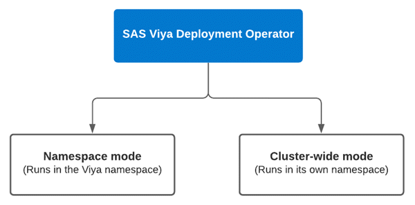
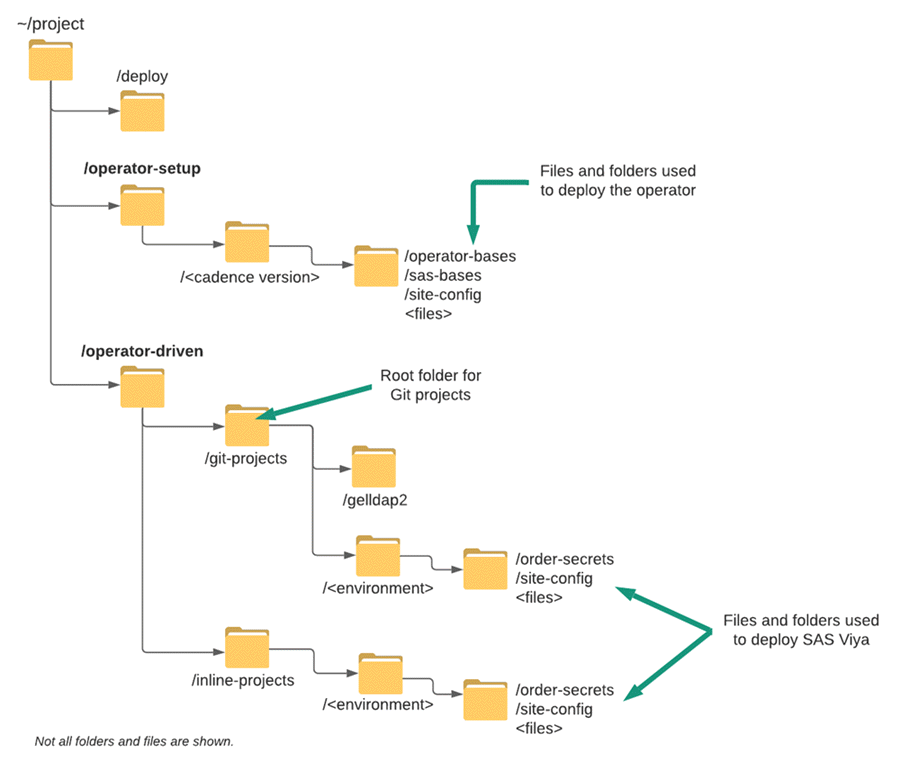

# Deployment Operator environment set-up

**THIS EXERCISE IS STILL UNDER CONSTRUCTION**

* [Introduction](#introduction)
  * [File system structure for the lab exercises](#file-system-structure-for-the-lab-exercises)
* [Let's get started...](#lets-get-started)
  * [1. You have used the full-automation deployment script to deploy Kubernetes and SAS Viya](#1-you-have-used-the-full-automation-deployment-script-to-deploy-kubernetes-and-sas-viya)
  * [2. Kubernetes and SAS Viya have not been deployed](#2-kubernetes-and-sas-viya-have-not-been-deployed)
* [Deploying the SAS Viya Deployment Operator](#deploying-the-sas-viya-deployment-operator)
  * [Create the working directory](#create-the-working-directory)
  * [Copy the Assets and Extract](#copy-the-assets-and-extract)
  * [Deploy the SAS Viya Deployment Operator](#deploy-the-sas-viya-deployment-operator)
    * [Step 1. Edit the transformer.yaml](#step-1-edit-the-transformeryaml)
    * [Step 2. Edit kustomization.yaml for cluster-wide scope](#step-2-edit-kustomizationyaml-for-cluster-wide-scope)
    * [Step 3. Build and Apply the manifests](#step-3-build-and-apply-the-manifests)
  * [Checking the deployment (optional)](#checking-the-deployment-optional)
* [Next Steps](#next-steps)
  * [Table of Contents for the Deployment Operator exercises](#table-of-contents-for-the-deployment-operator-exercises)
* [Complete Hands-on Navigation Index](#complete-hands-on-navigation-index)

## Introduction

This lab contains a set of exercises to provide experience with using the SAS Viya Deployment Operator.

The SAS Viya Deployment Operator watches the cluster for a Custom Resource (CR) of the `Kind: SASDeployment`. The data in the SASDeployment custom resource is used by the operator when installing SAS Viya.

The operator can run in two modes:

* *"Namespace"* mode:
  * A long-lived pod inside the Viya namespace
* *"Cluster-wide"* mode
  * A long-lived pod in its own namespace, separate from the Viya namespace(s).

This is illustrated below.



In this set of exercises you will use the operator in cluster-wide mode. The advantage of using the operator in cluster-wide mode is that you can delete the Viya namespace without deleting (killing) the operator.

### File system structure for the lab exercises

Before you start the lab exercises let's take a moment to discuss the file system structure that will be used. To date for the other exercises you have been using the `~/project/deploy/` folder.

For this set of exercises you will use the structure shown in the image below.



* The `/operator-setup` folder is the root folder for the configuration files for the deployment operator itself. We recommend organising the files by cadence version of the operator being used. For example, stable-202x.y.z or lts-202x.y.
* The `/operator-driven` folder is the root folder for the Viya environment(s) kustomisation and input files.
* When using the deployment operator there are two possible ways of providing the input files:
  1. Storing them in a **git** repository
  1. Passing them as **inline** content in a YAML file
  * Hence, the '**git-projects**' and '**inline-projects**' folders.
* Although both methods will be covered, the **git** method is likely to be better and easier than the alternative, and so that is the first one we'll cover.

## Let's get started...

**Important!**


***Note, the lab exercises using GitLab in the EKS cluster are still being developed.***

***In the meantime, the Deployment Operator exercises in PSGEL255 and PSGEL298 have the GitLab exercises.***

In this lab exercise you will perform a number of steps to establish the environment in order to use the Deployment Operator to deploy SAS Viya.

Before starting this lab exercise, it's important to that you confirm your entry point prior to this lab exercise. Choose **one** of the entry points below which reflect what you have done so far and then read their accompanying notes:

1. You have used the full-automation script to deploy Kubernetes and SAS Viya.
1. Kubernetes and SAS Viya have NOT been deployed.

### 1. You have used the full-automation deployment script to deploy Kubernetes and SAS Viya

This assumes you have completed all the steps within [Full automation of deployment](../../Track-B-Automated/03_520_Deploy_SAS_Viya.md) exercise.

If you have completed the *03_520_Deploy_SAS_Viya* lab exercise, then the first step before proceeding with the Deployment Operator exercises below is to clean-up any existing Viya deployments. The easiest way to do this is to delete the existing Viya namespace(s).

<!--
### 2. You performed a manual deployment of Kubernetes and SAS Viya

If you have completed the manual deployment lab exercises, then the first step before proceeding with the Deployment Operator exercises below is to clean-up any existing Viya deployments. The easiest way to do this is to delete the existing Viya namespace(s).
-->

### 2. Kubernetes and SAS Viya have not been deployed

If you have yet to deploy the Kubernetes cluster and Viya using the previous exercises, then complete the following steps:

1. Provision the resources in AWS (03_510_Provision_Resources.md), click [here](../../Track-B-Automated/03_510_Provision_Resources.md)

1. Prepare the cluster for SAS Viya (00_110_Performing_the_prerequisites.md), click [here](../00-Common/00_110_Performing_the_prerequisites.md)

---

<!-- Removed until the GitLab issues are resolved

## Installation and set-up of GitLab

As a good practice you can, or should, use Git (or similar source code control system) to version control all the input and configuration files used to deploy a SAS Viya environment, even if you're not using the Deployment Operator.

To illustrate this we will create a Git project for the GELLDAP configuration and project(s) to store the SAS environments. We will also store the order secrets under the Viya environment project.

In preparation for the first deployment exercise you will now setup a Git server in your cluster. You would likely not do that at a customer, and instead use one of their existing Version Control system.

In this exercise we will run the GitLab instance in your AKS cluster. To make things easier for you we will script a number of the set-up tasks.

1. Create the working folder.

    ```sh
    # Create the base working folder
    mkdir -p ~/project/operator-driven/working/
    ```

1. To use Helm to deploy GitLab, the first step is to update the helm repo.

    ```sh
    ## the Helm repo for gitlab:
    helm repo add gitlab https://charts.gitlab.io/

    ## update its content
    helm repo update

    ## check out the versions that are available
    helm search repo -l gitlab/gitlab
    ```

1. Run the following to create the script to deploy GitLab on the jumphost server.

    ```sh
    # Create the script file to deploy GitLab
    tee  ~/project/operator-driven/working/git-instance-create.sh > /dev/null << EOF
    #!/bin/bash
    echo "Remove any existing gitlab namespace"
    kubectl delete namespace gitlab
    kubectl create namespace gitlab

    # Get your name in AWS
    MY_AWSNAME=`cat ~/MY_AWSNAME.txt`
    export STUDENT=${MY_AWSNAME,,}        # convert to all lower-case
    export INGRESSNAME="${STUDENT}.gelsandbox.aws.unx.sas.com"

    echo "Starting the GitLab install for \${INGRESSNAME} ..."

    helm upgrade --install gitlab gitlab/gitlab \
    --timeout 600s \
    --set global.hosts.domain=\${INGRESSNAME} \
    --set global.hosts.https=false \
    --set certmanager-issuer.email=me@example.com \
    --set global.edition=ce \
    --set nginx-ingress.enabled=false \
    --set global.ingress.enabled=true \
    --set global.ingress.class=nginx \
    --set global.ingress.tls.enabled=false \
    --namespace gitlab \
    --version v4.10.2 \
    --set postgresql.image.registry=us-east1-docker.pkg.dev/sas-gelsandbox/gelregistry \
    --set postgresql.image.repository=bitnami/postgresql \
    --set postgresql.image.tag=11.9.0 \
    --set postgresql.metrics.image.registry=us-east1-docker.pkg.dev/sas-gelsandbox/gelregistry \
    --set postgresql.metrics.image.repository=bitnami/postgres-exporter \
    --set postgresql.metrics.image.tag=0.8.0-debian-10-r99 \
    --set postgresql.volumePermissions.image.registry=us-east1-docker.pkg.dev/sas-gelsandbox/gelregistry \
    --set postgresql.volumePermissions.image.repository=bitnami/minideb:buster \
    --set global.minio.image=us-east1-docker.pkg.dev/sas-gelsandbox/gelregistry/minio/minio:RELEASE.2017-12-28T01-21-00Z \
    --set global.minio.minioMc.image=us-east1-docker.pkg.dev/sas-gelsandbox/gelregistry/minio/minio:RELEASE.2017-12-28T01-21-00Z \
    --set minio.image=us-east1-docker.pkg.dev/sas-gelsandbox/gelregistry/minio/minio \
    --set minio.tag=RELEASE.2017-12-28T01-21-00Z \
    --set minio.minioMc.image=us-east1-docker.pkg.dev/sas-gelsandbox/gelregistry/minio/minio \
    --set minio.minioMc.tag=RELEASE.2017-12-28T01-21-00Z \
    --set busybox.image.repository=us-east1-docker.pkg.dev/sas-gelsandbox/gelregistry/busybox:latest \
    --set redis.image.registry=us-east1-docker.pkg.dev/sas-gelsandbox/gelregistry \
    --set redis.image.repository=bitnami/redis \
    --set redis.image.tag=6.0.9-debian-10-r0 \
    --set redis.metrics.image.registry=us-east1-docker.pkg.dev/sas-gelsandbox/gelregistry \
    --set redis.metrics.image.repository=bitnami/redis-exporter \
    --set redis.metrics.image.tag=1.12.1-debian-10-r11 \
    --set redis.sentinel.image.registry=us-east1-docker.pkg.dev/sas-gelsandbox/gelregistry \
    --set redis.sentinel.image.repository=bitnami/redis-sentinel:6.0.8-debian-10-r55 \
    --set redis.sysctlImage.registry=us-east1-docker.pkg.dev/sas-gelsandbox/gelregistry \
    --set redis.sysctlIimage.repository=bitnami/minideb:buster \
    --set redis.volumePermissions.image.registry=us-east1-docker.pkg.dev/sas-gelsandbox/gelregistry \
    --set redis.volumePermissions.image.repository=bitnami/minideb:buster \
    --set nginx-ingress.controller.admissionWebhooks.patch.image.repository=us-east1-docker.pkg.dev/sas-gelsandbox/gelregistry/jettech/kube-webhook-certgen:v1.5.0 \
    --set prometheus.server.image.repository=us-east1-docker.pkg.dev/sas-gelsandbox/gelregistry/prom/prometheus \
    --set prometheus.server.image.tag=v2.15.2

    # Wait for GitLab to be ready
    # State is: Waiting for GitLab logon to be running
    GIT_URL="http://gitlab.\${INGRESSNAME}"
    echo "URL:\${GIT_URL}"
    #PORT=80
    # Write out the GitLab URL
    printf "\nYour GitLab URL is: \$GIT_URL \n\n"
    # Save the status in some variable
    STATUS="\$(curl \$GIT_URL -k -s -f -o /dev/null && echo 'READY' || echo 'ERROR')"
    echo "Waiting for GitLab to be Ready..."
    while [ \$STATUS != "READY" ]; do
        printf "..."
        STATUS="\$(curl \$GIT_URL -k -s -f -o /dev/null && echo 'READY' || echo 'ERROR')"
        sleep 5
        printf "..."
        sleep 5
    done
    printf "\n"
    echo "GitLab status is: " \$STATUS

    echo "Extra wait for the system to stablize"
    sleep 20


    printf "\nSet-up complete!\n\n"

    EOF

    cd ~/project/operator-driven/working/
    chmod +x git-instance-create.sh
    ```

1. Run the following command to set up authentication to the GEL Registry:

    ```sh
    gcloud auth configure-docker us-east1-docker.pkg.dev
    ```

1. Run the script to create the GitLab instance. This will take a few minutes to run.

    **Have you created the wildcard DNS alias? Create it before running this script!**

    ```sh
    cd ~/project/operator-driven/working/
    # Run the script
    ./git-instance-create.sh
    ```

    You should now have a running instance of GitLab.

1. Once GitLab is running, we can query GitLab for the default password for the root account.

    ```sh
    gitlab_root_pw=$(kubectl -n gitlab get secret \
    gitlab-gitlab-initial-root-password \
    -o jsonpath='{.data.password}' | base64 --decode )
    echo $gitlab_root_pw

    printf "\n* [GitLab URL (HTTP)](http://gitlab.${INGRESSNAME}/ )  (User=root Password=${gitlab_root_pw})\n\n" | tee -a ~/urls.md
    ```

### Initialize the Git user and create the folder for the Git projects

1. Now tell git to remember your credentials. For this we will use a script (`config-git-user.sh`) to set the Git user to default Administrator (root) user.

    *You wouldn't do this at a customer site but it makes the lab easier and allows us to automate the deployment.*

    ```sh
    # Retrieve the root user password
    gitlab_root_pw=$(kubectl -n gitlab get secret \
    gitlab-gitlab-initial-root-password \
    -o jsonpath='{.data.password}' | base64 --decode )
    echo $gitlab_root_pw

    bash -c "cat << EOF > ~/project/operator-driven/working/config-git-user.sh
    #!/bin/bash
    git config --global credential.helper store
    git config --global http.sslVerify false

    git config --global user.name \"Administrator\"
    git config --global user.username \"root\"
    git config --global user.password \"${gitlab_root_pw}\"
    git config --global user.email \"admin@example.com\"

    printf \"\n** User config set\n\n\"
    EOF"

    chmod +x ~/project/operator-driven/working/config-git-user.sh
    ```

1. Run the `config-git-user.sh` script to initialise the Git client.

    ```sh
    cd ~/project/operator-driven/working/
    ./config-git-user.sh
    ```

1. Create the root folder for the Git Projects.

    ```sh
    mkdir -p ~/project/operator-driven/git-projects/
    ```

## Set-up the GELLDAP Git Project

In the next set of lab exercises we will use the GEL OpenLDAP (GELLDAP) as the LDAP for user authentication and identities. So we need to set this up first.  We will run the GELLDAP within the SAS Viya namespace to simplify the connectivity to the GELLDAP instance.

* In the prep steps you cloned the GELLDAP project into the project directory, and set-up the manifest (gelldap-build.yaml).

1. Copy the GELLDAP files to your git (GELLDAP2) project.

    As we don't want to overwrite the '.git' folder in the GELLDAP2 project, you will copy the files in a staged approach. This is really just a problem in our VLE environment as you are coping the files from one Git project to another Git project.

    ```sh
    rm -Rf ~/project/gelldap/
    cp -R ~/payload/gelldap ~/project/
    mkdir -p ~/project/operator-driven/git-projects/gelldap2

    # Copy the required files.
    cp -r ~/project/gelldap/Readme.md ~/project/operator-driven/git-projects/gelldap2/
    cp -r ~/project/gelldap/bases/ ~/project/operator-driven/git-projects/gelldap2/
    cp -r ~/project/gelldap/no_TLS/ ~/project/operator-driven/git-projects/gelldap2/
    cp -r ~/project/gelldap/yes_TLS/ ~/project/operator-driven/git-projects/gelldap2/
    # cp -r ~/project/gelldap/gelldap-build.yaml ~/project/operator-driven/git-projects/gelldap2/

    cd ~/project/operator-driven/git-projects/gelldap2
    ls -al
    ```

    Your `/git-projects/gelldap2` folder should now look like the following.

    ```log
    drwxr-xr-x 5 cloud-user docker        91 May 10 22:58 .
    drwxrwxr-x 6 cloud-user cloud-user    22 May 10 22:58 ..
    drwxr-xr-x 4 cloud-user docker        62 May 10 22:58 bases
    drwxr-xr-x 4 cloud-user docker    163794 May 10 22:58 gelldap-build.yaml
    drwxr-xr-x 2 cloud-user docker       142 May 10 22:58 no_TLS
    -rw-r--r-- 1 cloud-user docker     12048 May 10 22:58 Readme.md
    drwxr-xr-x 2 cloud-user docker       166 May 10 22:58 yes_TLS
    ```

Now you need to push the files to the GELLDAP2 project. We will automate these steps using a couple of scripts.

3. Run the following to create the `create-gelldap-project.sh` script.

    ```sh
    cd ~/project/operator-driven/working/
    PROJECT_URL=http://gitlab.${INGRESSNAME}/root/gelldap2.git

    bash -c "cat << EOF > ~/project/operator-driven/working/create-gelldap-project.sh
    #!/bin/bash

    # Build the GELLDAP manifest (gelldap-build.yaml)
    cd ~/project/operator-driven/git-projects/gelldap2/no_TLS

    kustomize build -o ~/project/operator-driven/git-projects/gelldap2/gelldap-build.yaml

    cd ~/project/operator-driven/git-projects/gelldap2/

    # Set the registry to the GEL Registry - us-east1-docker.pkg.dev/sas-gelsandbox/gelregistry
    #sed -i 's/gelharbor.race.sas.com/us-east1-docker.pkg.dev\/sas-gelsandbox\/gelregistry/' ./gelldap-build.yaml

    # Initialize the GELLDAP2 repository
    git init
    git remote add origin ${PROJECT_URL}

    git add .
    git commit -m \"Initial commit to backup the GELLDAP files\"

    # Note this will throw an error for the first PUSH
    #  git push --set-upstream ${PROJECT_URL} master
    #git push ${PROJECT_URL}

    # This will error but it is expected
    # printf \"\n** This error is expected.\n\"
    # printf \"** The next step will push the project specifying the username and password.\n\"
    # printf \"\n\"

    EOF"

    # Set the execute permission
    chmod +x ~/project/operator-driven/working/create-gelldap-project.sh
    ```

1. Create the script to PUSH the files to the Git server.

    ```sh
    cd ~/project/operator-driven/working/
    # Set the host URL
    HOST_URL=http://gitlab.${INGRESSNAME}
    PROJECT_URL=http://gitlab.${INGRESSNAME}/root/gelldap2.git

    # Retrieve the GitLab root password
    GITLAB_ROOT_PW=$(kubectl -n gitlab get secret \
    gitlab-gitlab-initial-root-password \
    -o jsonpath='{.data.password}' | base64 --decode )
    #echo $GITLAB_ROOT_PW

    bash -c "cat << EOF > ~/project/operator-driven/working/push-gelldap-updates.sh
    #!/usr/bin/expect -f

    cd ~/project/operator-driven/git-projects/gelldap2/

    set timeout -1

    spawn git push ${PROJECT_URL}
    #spawn ./create-gelldap-project.sh

    expect \"Username for '${HOST_URL}':\"
    send -- \"root\r\"

    expect \"Password for*\"
    send -- \"${GITLAB_ROOT_PW}\r\"

    expect eof

    EOF"

    # Set the execute permission
    chmod +x ~/project/operator-driven/working/push-gelldap-updates.sh
    ```

1. Run the following to push the files to the Git project.

    ```sh
    cd ~/project/operator-driven/working/

    # Create the project
    ./create-gelldap-project.sh

    # Push the files to the Git server
    ./push-gelldap-updates.sh
    ```

    *Note, if you get an authentication failure message then re-run the `**./push-gelldap-updates.sh**` script again.*

This completes the initial deployment and set-up of GitLab, and the creation of the GELLDAP2 project.

If you want to login to GitLab to check the project, use the admin (root) user. Issue the following command to retrieve the password.

***Note, unless you are on the SAS Cary or Marlow networks you will have to use the Windows Client from the workshop collection to access to your GitLab environment.***

```sh
cat ~/urls.md | grep GitLab
```

Your GELLDAP2 project should now look similar to this.


-->

## Deploying the SAS Viya Deployment Operator

Before you can deploy SAS Viya, the first step is to set-up and deploy the operator in the Kubernetes cluster. Use the following instructions to do this.

### Create the working directory

You need the create a directory to hold the files to configure the operator.

1. Issue the following command to create the working directory.

    ```sh
    DEPOP_VER=stable-2020.1.5
    mkdir -p ~/project/operator-setup/${DEPOP_VER}
    cd ~/project/operator-setup/${DEPOP_VER}
    ```

### Copy the Assets and Extract

1. Get the .tgz name for the order.

    ```sh
    # Remove any existing file
    rm ~/project/operator-setup/simple_order.txt
    #
    CADENCE_NAME='stable'
    CADENCE_VERSION='2020.1.5'
    ORDER='9CFHCQ'

    ORDER_FILE=$(ls ~/orders/ \
        | grep ${ORDER} \
        | grep ${CADENCE_NAME} \
        | grep ${CADENCE_VERSION} \
        | sort \
        | tail -n 1 \
        )
    echo ${ORDER_FILE} | tee ~/project/operator-setup/simple_order.txt
    ```

1. Copy the Deployment Assets.

    ```sh
    cp ~/orders/$(cat ~/project/operator-setup/simple_order.txt) ~/project/operator-setup/${DEPOP_VER}/
    cd ~/project/operator-setup/${DEPOP_VER}
    ls -al
    ```

1. Extract the Assets.

    ```sh
    cd ~/project/operator-setup/${DEPOP_VER}
    tar xf $(cat ~/project/operator-setup/simple_order.txt)
    ```

1. Now you need the order certificates (\*.zip) and the license (\*.jwt) files. We can download these from our GELWEB server. Please copy all the lines below in one step.

    ```sh
    cd ~/project/operator-setup/${DEPOP_VER}
    GELWEB_ZIP_FOL=https://gelweb.race.sas.com/scripts/viya4orders/

    for order in $(curl -k -s  ${GELWEB_ZIP_FOL} | grep  -E -o 'href=".*\.jwt"|href=".*\.zip"' \
        | sed 's|href=||g' | sed 's|"||g' \
        | grep -i "${ORDER}" \
        | sort -u \
        ) ; do
        echo "found order called $order"
        #curl -k -o ~/project/operator-setup/${order} ${GELWEB_ZIP_FOL}/${order}
        curl -k -o ~/project/operator-setup/${DEPOP_VER}/${order} ${GELWEB_ZIP_FOL}/${order}
    done
    ```

    While you don't need the license (\*.jwt) file to deploy the operator we will download it now so that you have it ready for when you deploy a SAS Viya environment.

1. Copy the operator files to the top level of the `/operator-setup` directory and make them writable:

    ```sh
    cd ~/project/operator-setup/${DEPOP_VER}
    cp -r sas-bases/examples/deployment-operator/deploy/* .
    # Set the permissions on the file
    chmod +w site-config/transformer.yaml

    ls -al
    ```

The directory should now look similar to the following.

```log
./stable-202x.y.z/
    └── kustomization.yaml
    ├── operator-base/
    ├── sas-bases/
    ├── SASViyaV4_9CFHCQ_certs.zip
    ├── SASViyaV4_9CFHCQ_license.jwt
    ├── SASViyaV4_9CFHCQ_stable_2020.1.5_20210504.1620160646709_deploymentAssets_2021-05-05T060327.tgz
    ├── simple_order.txt
    └── site-config/
           └── cluster-wide-transformer.yaml
           └── transformer.yaml
```

The kustomization.yaml file in the `/operator-setup` directory is referred to as the '**operator kustomization.yaml**' file throughout the documentation.

---

### Deploy the SAS Viya Deployment Operator

Use the following steps to configure the operator for your environment.

#### Step 1. Edit the transformer.yaml

In the `transformer.yaml` file (_./operator-setup/site-config/transformer.yaml_) we need to set the namespace and the name for the operator ClusterRoleBinding that wil be used.

* Set namespace to: '**sasoperator**' and the name of the ClusterRole binding to '**sasopcrb**'.

  Issue the following commands to edit the file.

    ```sh
    cd ~/project/operator-setup/${DEPOP_VER}
    # Take a backup of the original file
    cp ./site-config/transformer.yaml ./site-config/transformer-bak.yaml

    # Update the default value for ClusterRole binding
    sed -i 's/{{\ NAME\-OF\-CLUSTERROLEBINDING\ }}/sasopcrb/' ./site-config/transformer.yaml
    # Update the default value for the namespace
    sed -i 's/{{\ NAME\-OF\-NAMESPACE\ }}/sasoperator/' ./site-config/transformer.yaml

    # Look at the difference to confirm the update
    icdiff site-config/transformer-bak.yaml site-config/transformer.yaml
    ```

>***Notes***
>
>*The SAS Viya Deployment Operator can be configured to respond to SASDeployment resources in its own namespace **only** (namespace scope) or in all SASDeployment resources in **all** namespaces (cluster-wide scope).*
>
>*If the operator is being used in 'namespace scope' the name of the namespace is the namespace where you will deploy SAS Viya. For example, lab or dev.*
>
>*If the operator is being used in cluster-wide scope then you need to update the kustomization.yaml file, see the next step.*

#### Step 2. Edit kustomization.yaml for cluster-wide scope

In this hands-on we will run the operator in cluster-wide scope ( but you could also run it only at the namespace level).

If the operator is being deployed in cluster-wide scope, the reference to `site-config/cluster-wide-transformer.yaml` in the operator kustomization.yaml should be uncommented.

1. Use the following command to uncomment the cluster-wide-transformer.yaml reference in the file kustomization.yaml.

    ```sh
    cd ~/project/operator-setup/${DEPOP_VER}
    sed -i 's/#- site-config/- site-config/' ./kustomization.yaml
    ```

#### Step 3. Build and Apply the manifests

The next step is to build and deploy the operator.

* Issue the following commands.

  ```sh
  # Create the namespace that will be used
  kubectl create ns sasoperator
  #
  cd ~/project/operator-setup/${DEPOP_VER}
  # Build the site.yaml for the deployment operator
  kustomize build -o operator-site.yaml
  # Apply the operator-site.yaml
  kubectl -n sasoperator apply -f operator-site.yaml
  ```

You should see the following output.

```log
$ kubectl -n sasoperator apply  -f operator-site.yaml
customresourcedefinition.apiextensions.k8s.io/sasdeployments.orchestration.sas.com configured
serviceaccount/sas-deployment-operator created
role.rbac.authorization.k8s.io/sas-deployment-operator created
clusterrole.rbac.authorization.k8s.io/sas-deployment-operator configured
rolebinding.rbac.authorization.k8s.io/sas-deployment-operator created
clusterrolebinding.rbac.authorization.k8s.io/sasoperator unchanged
secret/sas-image-pull-secrets-hbk84mfhhk created
secret/sas-license-c26m8mh9b8 created
secret/sas-lifecycle-image-gtdccb7c2b created
secret/sas-repositorywarehouse-certificates-fhf945mb44 created
deployment.apps/sas-deployment-operator created
```

### Checking the deployment (optional)

To check what was created we can do the following:

1. List the pods running in the namespace

   ```sh
   kubectl get pods -n sasoperator
   ```

   You should see that the is one pod running. The output should look something like this.

   ```log
   NAME                                       READY   STATUS    RESTARTS   AGE
   sas-deployment-operator-79f5d86fc6-lzkfj   1/1     Running   0          25s
   ```

1. Now that the operator is running you can review the sas-deployment-operator pod.

   ```sh
   kubectl describe pod sas-deployment-operator -n sasoperator
   ```

1. Check that the ClusterRoleBinding has been created. If you have overridden the default name you should see this change.

    ```sh
    kubectl get ClusterRoleBinding | grep sas-deployment-operator
    ```

    You should see output similar to below.

    ```log
    sasopcrb                          ClusterRole/sas-deployment-operator
    ```

1. Look at the details for the ClusterRoleBinding.

   ```sh
   kubectl describe ClusterRole/sas-deployment-operator
   ```

   You should see output similar to below.

   ```log
   Name:         sas-deployment-operator
   Labels:       app.kubernetes.io/name=sas-deployment-operator
                 sas.com/admin=cluster-wide
                 sas.com/deployment=sas-viya
   Annotations:  sas.com/component-name: sas-deployment-operator
                 sas.com/component-version: 1.45.3-20210512.1620856657319
                 sas.com/version: 1.45.3
   PolicyRule:
     Resources                                        Non-Resource URLs  Resource Names  Verbs
     ---------                                        -----------------  --------------  -----
     clusterrolebindings.rbac.authorization.k8s.io    []                 []              [bind create delete escalate get list patch update watch]
     clusterroles.rbac.authorization.k8s.io           []                 []              [bind create delete escalate get list patch update watch]
     cronjobs.batch                                   []                 []              [create get list patch update watch delete]
     jobs.batch                                       []                 []              [create get list patch update watch delete]
     rolebindings.rbac.authorization.k8s.io           []                 []              [create get list watch update patch delete bind escalate]
     roles.rbac.authorization.k8s.io                  []                 []              [create get list watch update patch delete bind escalate]
     services                                         []                 []              [get list watch create]
     sasdeployments.orchestration.sas.com             []                 []              [get list watch update]
     configmaps                                       []                 []              [list delete]
     secrets                                          []                 []              [list get delete watch create update]
     serviceaccounts                                  []                 []              [list get delete watch create update]
     sasdeployments.orchestration.sas.com/finalizers  []                 []              [update]
   ```

## Next Steps

Now that you have the environment set-up and the Deployment Operator running in cluster-wide scope, the next exercise will walk you through a deployment using a Git repository.

Click [here](../02-DepOp/02_310_Using_the_DO_with_a_Git_Repository.md) to move onto the next exercise: ***02_310_Using_the_DO_with_a_Git_Repository.md***

### Table of Contents for the Deployment Operator exercises

<!--Navigation for this set of labs-->
* [Creating an EKS Cluster](../../Track-B-Automated/03_510_Provision_Resources.md)
* [00-Common / 00 110 Performing the prerequisites](../00-Common/00_110_Performing_the_prerequisites.md)
* [02-DepOp / 02 300 Deployment Operator environment set up](./02_300_Deployment_Operator_environment_set-up.md) **<-- You are here**
* [02-DepOp / 02 310 Using the DO with a Git Repository](./02_310_Using_the_DO_with_a_Git_Repository.md)
* [02-DepOp / 02 320 Using an inline configuration](./02_320_Using_an_inline_configuration.md)
* [02-DepOp / 02 330 Using the Orchestration Tool](./02_330_Using_the_Orchestration_Tool.md)
* [00-Common / 00 400 Cleanup](../00-Common/00_400_Cleanup.md)

## Complete Hands-on Navigation Index

<!-- startnav -->
<!-- endnav -->


