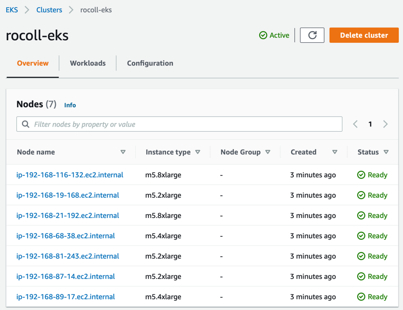

# Provision the resources in AWS

- [Acquiring tools](#acquiring-tools)
- [Simplify commands](#simplify-commands)
- [Identify yourself](#identify-yourself)
- [Configure Terraform](#configure-terraform)
  - [*Troubleshooting*](#troubleshooting)
- [Deploy the AWS infrastructure](#deploy-the-aws-infrastructure)
- [Unexpected failure?](#unexpected-failure)
- [Validate the environment](#validate-the-environment)
- [Setup kubectl](#setup-kubectl)
- [Navigation](#navigation)

To stand up the infrastructure we need to deploy SAS Viya, we will rely on the [viya4-iac-aws project](https://github.com/sassoftware/viya4-iac-aws) available from SAS in Github.
## Acquiring tools

1. Clone the viya4-iac-aws project and build the Docker container [viya4-iac-aws](https://github.com/sassoftware/viya4-iac-aws/blob/main/docs/user/DockerUsage.md) we'll use:

   ```bash
   # as cloud-user on your Linux host in RACE
   cd ~

   # clone the viya4-iac-aws repo
   git clone https://github.com/sassoftware/viya4-iac-aws

   cd ~/viya4-iac-aws

   # Build the viya4-iac-aws container
   docker build -t viya4-iac-aws .
   ```

2. Try running the viya4-iac-aws container

   ```bash
   # as cloud-user on your Linux host in RACE

   docker container run --rm -it viya4-iac-aws -version
   ```

   Results similar to:

   ```log
   Terraform v1.0.0
   on linux_amd64
   + provider registry.terraform.io/hashicorp/aws v3.43.0
   + provider registry.terraform.io/hashicorp/cloudinit v2.2.0
   + provider registry.terraform.io/hashicorp/external v2.1.0
   + provider registry.terraform.io/hashicorp/kubernetes v2.2.0
   + provider registry.terraform.io/hashicorp/local v2.1.0
   + provider registry.terraform.io/hashicorp/null v3.1.0
   + provider registry.terraform.io/hashicorp/random v3.1.0
   + provider registry.terraform.io/hashicorp/template v2.2.0
   + provider registry.terraform.io/terraform-aws-modules/http v2.4.1
   ```

   Note: Terraform is the default entry point of the container. And because we requested the version, it shows its own version as well as the other components it relies on.

4. Confirm that the AWS-CLI in the viya4-iac-aws container has access to your AWS tokens:

   ```bash
   # as cloud-user on your Linux host in RACE

   # aws configure list
   docker container run --rm --group-add root \
     --user $(id -u):$(id -g) \
     -v $HOME/.aws:/root/.aws \
     --entrypoint aws \
     viya4-iac-aws configure list

   # aws sts get-caller-identity
   docker container run --rm --group-add root \
     --user $(id -u):$(id -g) \
     -v $HOME/.aws:/root/.aws \
     --entrypoint aws \
     viya4-iac-aws sts get-caller-identity \
       --output json
   ```

   Results similar to:

   ```log
         Name                    Value             Type    Location
         ----                    -----             ----    --------
      profile                <not set>             None    None
   access_key     ****************IQP6 shared-credentials-file
   secret_key     ****************3J+B shared-credentials-file
       region                us-east-1      config-file    ~/.aws/config
   ```

   and

   ```log
   {
    "UserId": "AROAII3YLHREVLVPPDQDU:glsuser2@na.SAS.com_",
    "Account": "182696677754",
    "Arn": "arn:aws:sts::182696677754:assumed-role/testers/glsuser2@na.SAS.com_"
   }
   ```

   Note: `glsuser2` is a GEL-owned service account which we use to authenticate to AWS via the SAS Active Directory Federated Server. Normally you would expect this to return a "named" user. But for this workshop, we use this account along with some automation to keep AWS tokens up-to-date so you can use them.

## Simplify commands

Let's simplify the Docker commands we're going to use

At this point, you certainly understand we're running Terraform and the AWS CLI utilities inside of the viya4-iac-aws Docker container. That syntax is hard to remember and also difficult to compare to product documentation. Let's define aliases for them instead:

```bash
# as cloud-user on your Linux host in RACE

# Define
alias aws="docker container run --rm --group-add root --user $(id -u):$(id -g) -v $HOME/.aws:/root/.aws --entrypoint aws viya4-iac-aws"

alias terraform="docker container run --rm --group-add root --user $(id -u):$(id -g) -v $HOME/.aws:/root/.aws -v $HOME/.ssh:/root/.ssh -v $HOME/viya4-iac-aws:/workspace --entrypoint terraform viya4-iac-aws"

# Verify
aws --version

terraform --version
```

Results similar to:

```log
$ aws --version
aws-cli/2.1.29 Python/3.8.8 Linux/3.10.0-1062.12.1.el7.x86_64 docker/x86_64.amzn.2 prompt/off

$ terraform --version
Terraform v1.0.0
on linux_amd64
+ provider registry.terraform.io/hashicorp/aws v3.43.0
+ provider registry.terraform.io/hashicorp/cloudinit v2.2.0
+ provider registry.terraform.io/hashicorp/external v2.1.0
+ provider registry.terraform.io/hashicorp/kubernetes v2.2.0
+ provider registry.terraform.io/hashicorp/local v2.1.0
+ provider registry.terraform.io/hashicorp/null v3.1.0
+ provider registry.terraform.io/hashicorp/random v3.1.0
+ provider registry.terraform.io/hashicorp/template v2.2.0
+ provider registry.terraform.io/terraform-aws-modules/http v2.4.1
```

From now on, we'll use the aliases for the AWS CLI and for Terraform. If you open a new terminal window, then you'll need to redefine those aliases (unless you add them to your `.bash_profile`).

## Identify yourself 


The IAC utility can be configured to label and/or tag resources. Since all students in this workshop share the same account/role, this is an important configuration! 

**Get the prefix value for naming/tagging resources in AWS:**

```bash
# as cloud-user on your Linux host in RACE

# Determine your naming/tagging prefix:
# bash /opt/gellow_code/scripts/common/set_my_prefix.sh
# -- has already run at startup. 

# Get the prefix value for naming/tagging resources in AWS
MY_PREFIX=$(cat ~/MY_PREFIX.txt)

echo "Your prefix is: ${MY_PREFIX}".
```

Note: If the value shown for `$MY_PREFIX` is blank, then run the `set_my_prefix.sh` script again (see comments above).

Copy and paste the following:

```bash
# label the namespace (change if you want, optional)
NS="sasviya4aws" 
# no spaces! only letters, numbers, underscore

# create the project dir for this namespace
mkdir -p ~/project/deploy/${NS}

# saving your NS for later reference
echo $NS > ~/MY_NS.txt  
```

## Configure Terraform

1. The IAC will create machines in AWS which can be accessed with cloud-user's default SSH key (`~/.ssh/id_rsa`). So create that now.

   ```bash
   # as cloud-user on your Linux host in RACE

   # ensure there is a .ssh dir in $HOME
   ansible localhost -m file \
      -a "path=$HOME/.ssh mode=0700 state=directory"

   # ensure there is an ssh key that we can use
   ansible localhost -m openssh_keypair \
      -a "path=~/.ssh/id_rsa type=rsa size=2048" --diff

   # the resulting ~/.ssh/id_rsa file is searched by default when ssh'ing, unless a different file is specified using the -i switch.
   ```

3. Setup the tfvars file to identify the resources we want in AWS. 
   
   Note the use of `$MY_PREFIX` and the `ssh_public_key` in the **Required Variables** section. 

   ```bash
   # as cloud-user on your Linux host in RACE

   # Get your identification
   NS=`cat ~/MY_NS.txt`
   MY_PREFIX=`cat ~/MY_PREFIX.txt`
   MY_PREFIX=${MY_PREFIX,,}        # convert to all lower-case

   # Populate the TF variables file
   cd ~/viya4-iac-aws

   tee  ~/viya4-iac-aws/sasviya4aws.tfvars > /dev/null << EOF
   # !NOTE! - These are only a subset of variables.tf provided for sample.
   # Customize this file to add any variables from 'variables.tf' that you want
   # to change their default values.

   # ****************  REQUIRED VARIABLES  ****************
   # These required variables' values MUST be provided by the User
   prefix                                  = "$MY_PREFIX"
   location                                = "us-east-1" # e.g., "us-east-1"
   ssh_public_key                          = "~/.ssh/id_rsa.pub"
   create_static_kubeconfig                = true
   # ****************  REQUIRED VARIABLES  ****************

   # !NOTE! - Without specifying your CIDR block access rules, ingress traffic
   #          to your cluster will be blocked by default.

   # **************  RECOMENDED  VARIABLES  ***************
   # Include CIDR ranges for the sas.com domains
   #default_public_access_cidrs             = ["71.135.0.0/16"]  # e.g., ["123.45.6.89/32"]
   # we allow access from the RACE VMWARE and RACE Azure clients network
   default_public_access_cidrs         = ["149.173.0.0/16", "71.135.0.0/16", "52.226.102.80/32", "52.226.102.81/32"]
   # **************  RECOMENDED  VARIABLES  ***************

   # Optional: tags for all tagable items in your cluster.
   tags = { "resourceowner" = "$MY_PREFIX" , "project_name" = "$NS" , "gel_project" = "PSGEL297" }

   # Postgres config - By having this entry a database server is created. If you do not
   #                   need an external database server remove the 'postgres_servers'
   #                   block below.
   #postgres_servers = {
   #  default = {},
   #}

   ## Cluster config
   kubernetes_version                      = "1.20"
   default_nodepool_node_count             = 2
   default_nodepool_vm_type                = "m5.2xlarge"
   default_nodepool_custom_data            = ""

   ## General
   efs_performance_mode                    = "generalPurpose"
   storage_type                            = "standard"

   ## Cluster Node Pools config
   node_pools = {
     cas = {
       "vm_type" = "m5.2xlarge"
       "os_disk_type" = "gp2"
       "os_disk_size" = 200
       "os_disk_iops" = 0
       "min_nodes" = 4
       "max_nodes" = 5
       "node_taints" = ["workload.sas.com/class=cas:NoSchedule"]
       "node_labels" = {
         "workload.sas.com/class" = "cas"
       }
       "custom_data" = ""
       "metadata_http_endpoint"               = "enabled"
       "metadata_http_tokens"                 = "required"
       "metadata_http_put_response_hop_limit" = 1
     },
     compute = {
       "vm_type" = "m5.8xlarge"
       "os_disk_type" = "gp2"
       "os_disk_size" = 200
       "os_disk_iops" = 0
       "min_nodes" = 1
       "max_nodes" = 5
       "node_taints" = ["workload.sas.com/class=compute:NoSchedule"]
       "node_labels" = {
         "workload.sas.com/class"        = "compute"
         "launcher.sas.com/prepullImage" = "sas-programming-environment"
       }
       "custom_data" = ""
       "metadata_http_endpoint"               = "enabled"
       "metadata_http_tokens"                 = "required"
       "metadata_http_put_response_hop_limit" = 1
     },
     connect = {
       "vm_type" = "m5.8xlarge"
       "os_disk_type" = "gp2"
       "os_disk_size" = 200
       "os_disk_iops" = 0
       "min_nodes" = 1
       "max_nodes" = 5
       "node_taints" = ["workload.sas.com/class=connect:NoSchedule"]
       "node_labels" = {
         "workload.sas.com/class"        = "connect"
         "launcher.sas.com/prepullImage" = "sas-programming-environment"
       }
       "custom_data" = ""
       "metadata_http_endpoint"               = "enabled"
       "metadata_http_tokens"                 = "required"
       "metadata_http_put_response_hop_limit" = 1
     },
     stateless = {
       "vm_type" = "m5.4xlarge"
       "os_disk_type" = "gp2"
       "os_disk_size" = 200
       "os_disk_iops" = 0
       "min_nodes" = 1
       "max_nodes" = 5
       "node_taints" = ["workload.sas.com/class=stateless:NoSchedule"]
       "node_labels" = {
         "workload.sas.com/class" = "stateless"
       }
       "custom_data" = ""
       "metadata_http_endpoint"               = "enabled"
       "metadata_http_tokens"                 = "required"
       "metadata_http_put_response_hop_limit" = 1
     },
     stateful = {
       "vm_type" = "m5.4xlarge"
       "os_disk_type" = "gp2"
       "os_disk_size" = 200
       "os_disk_iops" = 0
       "min_nodes" = 1
       "max_nodes" = 3
       "node_taints" = ["workload.sas.com/class=stateful:NoSchedule"]
       "node_labels" = {
         "workload.sas.com/class" = "stateful"
       }
       "custom_data" = ""
       "metadata_http_endpoint"               = "enabled"
       "metadata_http_tokens"                 = "required"
       "metadata_http_put_response_hop_limit" = 1
     }
   }

   # Jump Server
   create_jump_vm                        = true
   jump_vm_admin                         = "jumpuser"
   jump_vm_type                          = "t3.medium"

   # NFS Server
   # required ONLY when storage_type is "standard" to create NFS Server VM
   create_nfs_public_ip                  = false
   nfs_vm_admin                          = "nfsuser"
   nfs_vm_type                           = "m5.xlarge"
   EOF

   echo -e "\nCONFIRM THE FOLLOWING IS UNIQUE! \nYour PREFIX for resources names/tags in AWS will be: ${MY_PREFIX}"
   ```

   Note also in the **Required Variables** section that we've included `create_static_kubeconfig = true`. This will embed a static key for kubectl (and other k8s clients, like Lens) in its config file. That is, it won't be tied to usual short-lived AWS tokens.

   Notice as well that we set the minimum number of CAS nodes to `4` instead of `1`. Normally we should be able to rely on the EKS Cluster Auto Scaler to automatically fire up more nodes for CAS when it sees there are pods that cannot run... but it's a known issue that the EKS Cluster Auto Scaler is incosistent. Amazon is working to resolve. If you want to manually change the number of running nodes in the CAS node pool later, use your browser to navigate to AWS Console > EC2 > Auto Scaling Groups > [PREFIX]-cas-[#########] > Edit > change Desired Capacity. 

   <hr>

   ### *Troubleshooting*

   Sometimes unexpected things happen. When building this workshop, we chose to use live projects which are continuously updated over time. Sometimes those projects introduct breaking changes we could not foresee and which you must deal with... not unlike the real world.

   If you have persistent problems in the next steps when attempting to generate or apply the Terraform plan, then you might need an *older* version of **viya4-iac-aws**. See our [Troubleshooting Tips page](03_999_Troubleshooting_Tips.md) for [selecting a specific version of a git project](03_999_Troubleshooting_Tips.md#selecting-a-specific-version-of-a-git-project).

   <hr>

4. Generate a Terraform plan

   Let's generate the TF plan for building AWS resources:

   ```bash
   # as cloud-user on your Linux host in RACE
   cd ~/viya4-iac-aws

   # generate the TF plan corresponding to the AWS cluster with multiple node pools
   TFPLAN=/workspace/sasviya4aws.plan    # path inside the container
   TFVARS=/workspace/sasviya4aws.tfvars  # path inside the container

   # terraform plan
   terraform plan \
       -input=false \
       -var-file=${TFVARS} \
       -out ${TFPLAN}
   # runs in seconds
   ```

   Results:

   ```log
   Refreshing Terraform state in-memory prior to plan...
   The refreshed state will be used to calculate this plan, but will not be
   persisted to local or remote state storage.

   data.external.git_hash: Refreshing state...
   data.external.iac_tooling_version: Refreshing state...

   // lines ommitted //

   ------------------------------------------------------------------------

   An execution plan has been generated and is shown below.
   Resource actions are indicated with the following symbols:
     + create
    <= read (data resources)

   Terraform will perform the following actions:

   // lines ommitted //

     # module.db.module.db_subnet_group.aws_db_subnet_group.this[0] will be created
     + resource "aws_db_subnet_group" "this" {
         + arn         = (known after apply)
         + description = "Database subnet group for rocolldb"
         + id          = (known after apply)
         + name        = (known after apply)
         + name_prefix = "rocolldb-"
         + subnet_ids  = (known after apply)
         + tags        = {
             + "Name"          = "rocolldb"
             + "environment"   = "dev"
             + "gel_project"   = "deployviya4aws"
             + "project_name"  = "sasviya4aws"
             + "resourceowner" = "rocoll"
           }
       }

   Plan: 93 to add, 0 to change, 0 to destroy.

   ------------------------------------------------------------------------

   This plan was saved to: /workspace/sasviya4aws.plan

   To perform exactly these actions, run the following command to apply:
       terraform apply "./sasviya4aws.plan"
   ```

   Note the instruction to run `terraform` directly will not work in our environment as we're running the `viya4-iac-aws` container with `terraform` inside it.

5. Review the generated plan:

   ```bash
   # as cloud-user on your Linux host in RACE
   cd ~/viya4-iac-aws

   TFPLAN=/workspace/sasviya4aws.plan    # path inside the container

   # terraform show
   terraform show ${TFPLAN}
   ```

   The plan shows all the infrastructure components that will be created in AWS to support the Viya deployment : Virtual network, Subnets, Public IPs, Network Security Groups, an EKS Kubernetes Cluster with several node pools and associated instance types.

## Deploy the AWS infrastructure

Now let's deploy the AWS infrastructure for our EKS cluster with the TF plan.

1. Apply the Terraform plan


   ```bash
   # as cloud-user on your Linux host in RACE
   cd ~/viya4-iac-aws

   # Deploy the AWS cluster with the TF plan
   TFPLAN=/workspace/sasviya4aws.plan      # path inside the container
   TFVARS=/workspace/sasviya4aws.tfvars    # path inside the container
   TFSTATE=/workspace/sasviya4aws.tfstate  # path inside the container

   # terraform apply
   terraform apply \
       -state ${TFSTATE} \
       "${TFPLAN}" \
       2>&1 | tee -a ./terraform-apply.log
   # runs in 10-15min
   ```

   Results:

   ```
   module.eks.aws_iam_policy.cluster_elb_sl_role_creation[0]: Creating...
   module.iam_policy.aws_iam_policy.policy: Creating...
   aws_resourcegroups_group.aws_rg: Creating...
   module.eks.aws_iam_role.cluster[0]: Creating...
   module.vpc.aws_vpc.this[0]: Creating...
   module.nfs.aws_key_pair.admin: Creating...
   module.nfs.aws_ebs_volume.raid_disk[1]: Creating...
   module.nfs.aws_ebs_volume.raid_disk[3]: Creating...
   module.nfs.aws_ebs_volume.raid_disk[2]: Creating...
   ...

   <lines ommitted>

   ...
   location = us-east-1
   nat_ip = 52.200.184.120
   nfs_admin_username = nfsuser
   nfs_private_ip = 192.168.50.147
   nsf_private_dns = ip-192-168-50-147.ec2.internal
   postgres_admin =
   postgres_fqdn =
   postgres_password = <sensitive>
   postgres_server_name =
   postgres_server_port =
   prefix = rocoll
   provider = aws
   rwx_filestore_endpoint = ip-192-168-50-147.ec2.internal
   rwx_filestore_path = /export
   worker_iam_role_arn = arn:aws:iam::182696677754:role/rocoll-eks20210511150232963200000009

   real    12m31.840s
   user    0m0.113s
   sys     0m0.089s
   ```

   Notice the rwx_filestore and NFS server info shown at the end.

## Unexpected failure?

*If Terraform completed the previous step without an obvious error, then skip ahead to [Validate the environment](#validate-the-environment).* 

At this point, you might see unexpected error messages describing Terraform's failure to complete the creation of the resources in AWS. It happens sometimes.

And we might have some help for you - see our [Troubleshooting Tips page](03_999_Troubleshooting_Tips.md). 

Once you've resolved the problem, then you must destroy the existing AWS infrastructure that you've built so far. Refer to the [Cleanup Resources page](03_590_Cleanup_Resources.md) and follow the instructions to **Destroy the AWS resources** and then try to run the `terraform apply` step again.


## Validate the environment

First, let's have Terraform show us the state of resources it just created in AWS:

   ```bash
   # as cloud-user on your Linux host in RACE
   cd ~/viya4-iac-aws

   TFSTATE=/workspace/sasviya4aws.tfstate    # path inside the container

   # terraform show
   terraform show ${TFSTATE}
   ```

There's a lot to see. Take your time to peruse it a bit. 

And when you're ready, then let's see what AWS can show us.

AWS relies on **names** and **tags** to help [identify and manage resources](https://docs.aws.amazon.com/ARG/latest/userguide/welcome.html). Still, it doesn't bundle everything together for you in a tidy grouping like [Azure's resource groups](https://docs.microsoft.com/en-us/azure/azure-resource-manager/management/manage-resource-groups-portal). But it's a start. Just remember that if something isn't tagged (or tagged _differently_) then you might not find it easily.

1. Logon to AWS Console, selecting the `sas-saslesenabletest/testers` role, and visit Services > [Resource Groups & Tag Editor](https://console.aws.amazon.com/resource-groups/home?region=us-east-1)

2. Under **Saved Resource Groups**, you should see your newly created resource group named with your prefix similar to `MY_PREFIX-rg` with approximately 35 items.

   *Q: How does this compare to when you viewed the TFPLAN and the number of items that Terraform created?*

   *A: They're very different numbers.*
   
   *Why: Not all resources in AWS can be given custom names/tags. It's a real challenge, honestly. Terraform, however, knows everything it created and tracks it all in its `.tfstate` file. So take care when using Terraform - if you misconfigure or otherwise invalidate (or even lose) that state file, then you must manually find and delete your resources.*

3. From the left-side nav menu, also try the **Tag Editor**. Select the region, "All Resource Types", and then for _Tag Key_ try selecting "resourceowner" and "Name" individually. Then click in the _Optional Tag Value_ field for the list of possible values. Notice that your `MY_PREFIX` appears in many items. But also that some items, like `MY_PREFIX_ebs_csi_policy` are _not_ shown.

   *Q: Is there a way to wildcard the tag values?*

   *A: Try and find out for yourself.*

4. Check out [your EKS cluster](https://console.aws.amazon.com/eks/home?region=us-east-1#/clusters) named similar to `MY_PREFIX-eks`. Note the Kubernetes version and the machine nodes.

   

## Setup kubectl

It's often useful to have command-line ability (or other client, like the Lens IDE) to query the state of our Kubernetes cluster. Direct Terraform to generate a kube config file for those clients. 

1. Use terraform to create a kube config file

   ```bash
   # as cloud-user on your Linux host in RACE

   # Get your identification
   NS=`cat ~/MY_NS.txt`

   cd ~/viya4-iac-aws

   # Where everything is
   TFSTATE=/workspace/sasviya4aws.tfstate  # path inside the container

   # Generate a kubectl configuration file (with old 0.13 or new 1.0 syntax)
   terraform output -state ${TFSTATE} -raw kube_config > ${NS}.kube.conf
   ```

   Note: the newer 1.0 syntax for Terraform requires the `-raw` parameter to generate a well-formed kubeconfig file. 

2. Place the kube config file for our Viya cluster in the default location referenced by the `kubectl` command

   ```bash
   # as cloud-user on your Linux host in RACE

   # If there's already a .kube directory, back it up
   [[ -d ~/.kube ]] && mv ~/.kube ~/.kube-backup
   
   # Create the .kube directory for your cluster
   mkdir -p ~/.kube

   cd ~/viya4-iac-aws

   # Duplicate the file to the standard location - don't use symlink (its real path won't resolve inside the container)
   cp -p ./${NS}.kube.conf   ~/.kube/config
   ```

4. Try it out

   ```bash
   # as cloud-user on your Linux host in RACE

   # Use kubectl inside the viya4-iac-aws container
   docker container run --rm --group-add root \
   --user $(id -u):$(id -g) \
   -v $HOME/.aws:/root/.aws \
   -v $HOME/.ssh:/root/.ssh \
   -v $HOME/.kube:/root/.kube \
   --entrypoint kubectl \
   viya4-iac-aws get nodes

   # But since we also have kubectl installed locally and we're providing the default named configuration file...
   kubectl get nodes
     ```

     Results:

     ```log
     NAME                              STATUS   ROLES    AGE   VERSION
     ip-192-168-116-132.ec2.internal   Ready    <none>   55m   v1.19.6-eks-49a6c0
     ip-192-168-19-168.ec2.internal    Ready    <none>   55m   v1.19.6-eks-49a6c0
     ip-192-168-21-192.ec2.internal    Ready    <none>   55m   v1.19.6-eks-49a6c0
     ip-192-168-68-38.ec2.internal     Ready    <none>   55m   v1.19.6-eks-49a6c0
     ip-192-168-81-243.ec2.internal    Ready    <none>   55m   v1.19.6-eks-49a6c0
     ip-192-168-87-14.ec2.internal     Ready    <none>   55m   v1.19.6-eks-49a6c0
     ip-192-168-89-17.ec2.internal     Ready    <none>   56m   v1.19.6-eks-49a6c0
     ```

# End

You've provisioned the infrastructure we'll use to run SAS Viya in the Amazon Web Services envrionment using the viya4-iac-aws project from SAS.

## Navigation

<!-- startnav -->
* [00 001 Access Environments](/00_001_Access_Environments.md)
* [README](/README.md)
* [Track B-Automated / 03 510 Provision Resources](/Track-B-Automated/03_510_Provision_Resources.md)**<-- you are here**
* [Track B-Automated / 03 520 Deploy SAS Viya](/Track-B-Automated/03_520_Deploy_SAS_Viya.md)
* [Track B-Automated / 03 590 Cleanup Resources](/Track-B-Automated/03_590_Cleanup_Resources.md)
<!-- endnav -->
