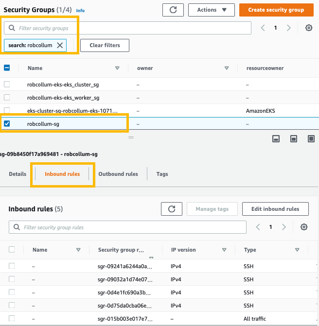
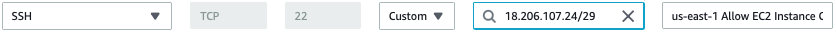
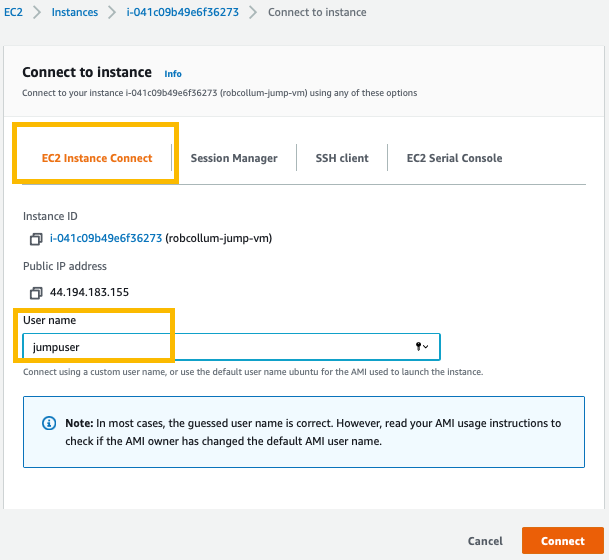
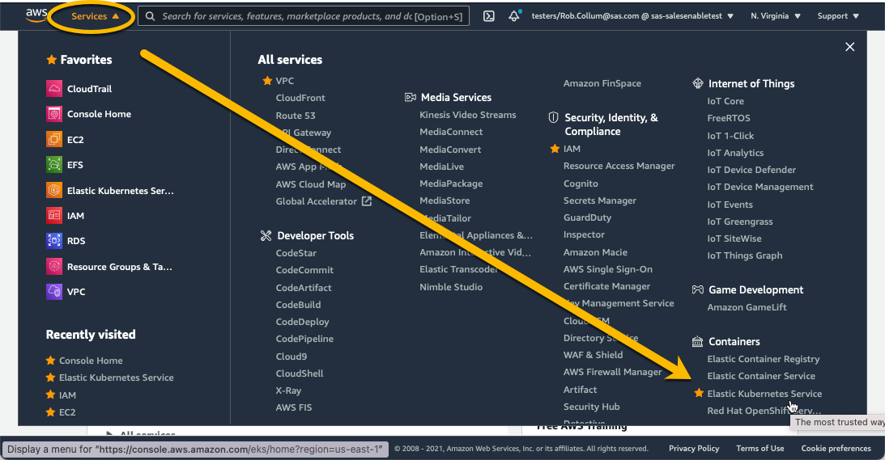
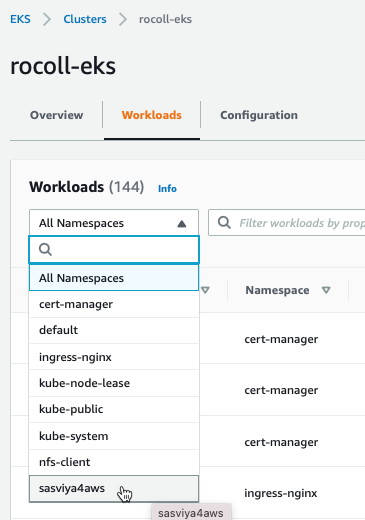
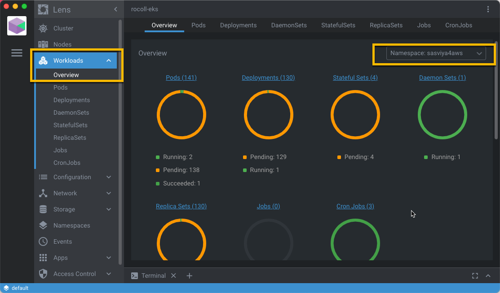

# Deploy SAS Viya in AWS

- [Acquiring tools](#acquiring-tools)
- [Establish an SSH connection to your jumpbox in AWS](#establish-an-ssh-connection-to-your-jumpbox-in-aws)
- [Create the directory structure in NFS](#create-the-directory-structure-in-nfs)
- [Configure the deployment of SAS Viya](#configure-the-deployment-of-sas-viya)
- [*Troubleshooting*](#troubleshooting)
- [Deploy Baseline Components for SAS Viya](#deploy-baseline-components-for-sas-viya)
- [Establish a Wildcard DNS alias for the Ingress to SAS Viya](#establish-a-wildcard-dns-alias-for-the-ingress-to-sas-viya)
- [Deploy SAS Viya Software](#deploy-sas-viya-software)
- [Monitor SAS Viya using AWS](#monitor-sas-viya-using-aws)
- [Monitor SAS Viya using Lens](#monitor-sas-viya-using-lens)
- [Validation](#validation)
- [Navigation](#navigation)

We will use the [viya4-deployment project](https://github.com/sassoftware/viya4-deployment) available from SAS in Github to deploy the SAS Viya software.
## Acquiring tools

1. Clone the viya4-deployment project and build the Docker container [viya4-deployment](https://github.com/sassoftware/viya4-deployment) we'll use:

   ```bash
   # as cloud-user on your Linux host in RACE
   cd ~

   # clone the viya4-deployment repo
   git clone https://github.com/sassoftware/viya4-deployment

   # already pointed at the latest tag
   # git checkout tags/4.9.0               # 4.9.0 or later is required for stable-2021.2.5
                                           # and is not backward-compatible with earlier Viya!
   ```

2. Update the git configuration to address a recent security vulnerability:

   ```bash
   # as cloud-user on your Linux host in RACE

   # allows the viya4-deployment repo to run with different file owner
   git config --global --add safe.directory /viya4-deployment
   # creates file /home/cloud-user/.gitconfig

   # copy it into the container files, too
   cp /home/cloud-user/.gitconfig /home/cloud-user/viya4-deployment
   # that's the top-level dir *inside* the container
   ```

   For more information, see the Github blog article, [Git security vulnerability announced](https://github.blog/2022-04-12-git-security-vulnerability-announced/) (April, 2022).


3. Try running the viya4-deployment container

   ```bash
   # as cloud-user on your Linux host in RACE
   cd ~/viya4-deployment

   # Build the viya4-deployment container
   docker build -t viya4-deployment .

   # And test that it works
   docker container run --rm -it viya4-deployment --version
   ```

   Results from the test:

   ```log
   Running: ansible-playbook -e BASE_DIR=/data -e *=/config/* --version playbooks/playbook.yaml
   ansible-playbook 2.10.9
     config file = /viya4-deployment/ansible.cfg
     configured module search path = ['/usr/share/ansible', '/viya4-deployment/plugins/modules']
     ansible python module location = /usr/local/lib/python3.8/dist-packages/ansible
     executable location = /usr/local/bin/ansible-playbook
     python version = 3.8.5 (default, Jan 27 2021, 15:41:15) [GCC 9.3.0]
   ```

   Note: The default entrypoint for this container is a shell script that expects to run an Ansible playbook. By specifying the `--version` parameter, we got this output instead.

## Establish an SSH connection to your jumpbox in AWS

* *Background info:*

  When using Terraform to deploy our infrastructure in AWS, we configured it to stand up two hosts _outside_ of the EKS cluster: the **jumpbox** and the **nfs-server**.

  The viya4-iac-aws tool used `id_rsa` SSH keypair in your `cloud-user`'s `.ssh` directory as the keypair in the EC2 hosts it created for our access, including the jumpbox and nfs-server.

  The jumpbox has a public IP address that can be reached from the outside world. However, the nfs-server (and the rest of our EKS nodes) do not - but they can be accessed from the jumpbox, if needed.

  One more thing, our hosts in RACE only have the ability to communicate with the outside world over HTTP/S. **They cannot use SSH to reach the jumpbox**. 

* *Challenge:* 

  In order for SAS Viya to function as expected, it expects a certain directory structure that we want hosted on an NFS server. Normally, the viya4-deployment utility could build it for us over SSH. But it cannot SSH from our RACE host to the jumpbox.

* *Objective:* 

  We need to create a simple directory structure on the **nfs-server**. We can do that by SSH'ing to the **jumpbox** where the top-level of the shared directory structure is already mounted. But SSH *from where?*

* *How to SSH from elsewhere:*

  The "obvious" answer is to copy the `id_rsa` private key file from `cloud-user`'s `.ssh` directory over to a host outside of RACE (like your PC) and then specify it when establishing an SSH connection to the `jumpuser` account on the jumpbox host. 

  Ex: `ssh -i /path/to/<cloud-user_id_rsa_file> jumpuser@<jumbox-public-ip-address>`


  If you're comfortable doing so, then proceed to connect with your own SSH and [skip ahead to the very next section](#create-the-directory-structure-in-nfs).

  Else if you want to use an AWS-provided approach, then let's setup **EC2 Instance Connect**.

  * AWS provides documentation for the [full process of configuring EC2 Instance Connect](https://docs.aws.amazon.com/AWSEC2/latest/UserGuide/ec2-instance-connect-set-up.html?icmpid=docs_ec2_console#ec2-instance-connect-setup-security-group).
     
  * For this workshop, we've already done most of the setup including defining policies and attaching them to roles. You just need to do the last step:

  * Provide an Inbound Rule to allow SSH communication to the jumpbox from the region where the EC2 Instance Connect will run:

    1. Logon to AWS Console, selecting the `sas-saslesenabletest/testers` role, and visit Services > EC2 > [Security Groups](https://console.aws.amazon.com/ec2/v2/home?region=us-east-1#SecurityGroups)

    2. Find the security group named similar to `MY_PREFIX-sg` (with your prefix or otherwise unique prefix identifier). Select it, then in the lower pane, select the **Inbound Rules** tab. 
     
        

    3. In the lower pane, click the button to **Edit Inbound Rules**

    4. At the bottom of that page, click the button to **Add Rule**

    5. Enter the following values for the new rule:

        

       * Type: `ssh`
       * Source: `custom` - and -  `18.206.107.24/29`
       * Description: `us-east-1 Allow EC2 Instance Connect `

       Note: That CIDR range for the source field is provided by AWS. It might change over time. And there are different CIDR ranges to specify for different AWS regions. [AWS explains it all here](https://docs.aws.amazon.com/general/latest/gr/aws-ip-ranges.html#aws-ip-download). 

    6. At the bottom of the page, click the button to **Save Rules**

  * Now connect to your jumpbox
    
    1. Navigate to Services > EC2 > [Instances](https://console.aws.amazon.com/ec2/v2/home?region=us-east-1#Instances) and filter using your PREFIX. 

    2. In the list, locate the instance named similar to `MY_PREFIX-jump-vm` and select it
       
    3. In the upper-right corner of the summary page for the jumpbox instance, click the button to **Connect**

    4.  The first option presented should be to use EC2 Instance Connect. Modify the **User name** field to `jumpuser`. 

          

    5.  Click the button to **Connect**

    6.  A new web browser window opens and, after a moment, you should see a command-line prompt similar to:

        ```log
        To run a command as administrator (user "root"), use "sudo <command>".
        See "man sudo_root" for details.

        jumpuser@ip-192-168-129-70:~$ 
        ```

## Create the directory structure in NFS

Now that you have an SSH connection to the jumpbox, create the new directory structure there. Remember, the IAC has already setup the jumpbox to mount the shared root directory hosted on the nfs-server. So while it looks like we're making directories on the jumpbox, we're actually creating them on the nfs-server. 

First make sure the jumpbox has mounted the NFS server root directory:

  ```bash
  # as jumpuser on your jumpbox in AWS

  # Confirm the root shared directory is there 
  [[ -d /viya-share/pvs ]] && echo -e "\nGood to go!" || echo -e "\nWhoa! Stop! It's not ready yet. Wait a few minutes and try again."
  ```

If it says it's good to go, then proceed:

  ```bash
  # as jumpuser on your jumpbox in AWS

  # Get your identification
  NS="sasviya4aws"          # use the same value that was set earlier on the RACE host

  # using the nfs-server's root directory
  mkdir /viya-share/${NS} # this is the custom namespace that the 
                          # IAC was unable to guess at earlier

  cd /viya-share/${NS}
  mkdir bin data homes astores

  # verify
  ls -l /viya-share /viya-share/${NS}

  exit  # quit the SSH session on the jumpbox
  ```

Results:

```log
$ ls -l /viya-share /viya-share/$NS
/viya-share:
total 24
drwxrwxrwx 2 nobody   nogroup  16384 Jul  8 14:15 lost+found
drwxrwxrwx 2 nobody   nogroup   4096 Jul  8 14:15 pvs
drwxrwxr-x 6 jumpuser jumpuser  4096 Jul  8 15:41 sasviya4aws

/viya-share/sasviya4aws:
total 16
drwxrwxr-x 2 jumpuser jumpuser 4096 Jul  8 15:41 astores
drwxrwxr-x 2 jumpuser jumpuser 4096 Jul  8 15:41 bin
drwxrwxr-x 2 jumpuser jumpuser 4096 Jul  8 15:41 data
drwxrwxr-x 2 jumpuser jumpuser 4096 Jul  8 15:41 homes
```

## Configure the deployment of SAS Viya

With these preliminary prerequisites in place, it's time to proceed with deploying SAS Viya. 

1. Build the Ansible vars file for the specified SAS Viya release. For a different cadence/release, modify the `V4_CFG_CADENCE_NAME` and `V4_CFG_CADENCE_VERSION` variables in the file below.

   ```bash
   # as cloud-user on your Linux host in RACE

   # Get your identification
   NS=`cat ~/MY_NS.txt`
   MY_PREFIX=`cat ~/MY_PREFIX.txt`
   MY_PREFIX=${MY_PREFIX,,}        # convert to all lower-case

   export V4_CFG_INGRESS_FQDN="${MY_PREFIX}.gelsandbox.aws.unx.sas.com"
   # We will setup this DNS alias in a future step

   tee  ~/project/deploy/${NS}/${NS}-viyavars.yaml > /dev/null << EOF
   ## Cluster
   PROVIDER: aws
   CLUSTER_NAME: ${NS}
   NAMESPACE: ${NS}

   ## MISC
   DEPLOY: true # Set to false to stop at generating the manifest

   #LOADBALANCER_SOURCE_RANGES: ['<cluster_nat_ip>/32']
   LOADBALANCER_SOURCE_RANGES: ["149.173.0.0/16", "71.135.0.0/16"]
   # Spexify the usual CIDR ranges assigned to SAS

   ## Storage - we let the tool create the SC for us
   V4_CFG_MANAGE_STORAGE: true
   #JUMP_SVR_RWX_FILESTORE_PATH: /volumes

   ## JUMP VM ACCESS TO PREPARE NFS DIRECTORIES
   # JUMP_SVR_PRIVATE_KEY: '/config/jump_svr_private_key'

   ## SAS API Access
   V4_CFG_SAS_API_KEY: 'otHGJtno8QGTqys9vRGxmgLOCnVsHWG2'
   V4_CFG_SAS_API_SECRET: 'banKYbGZyNkDXbBO'
   V4_CFG_ORDER_NUMBER: 9CKY1V

   ## CR Access
   # V4_CFG_CR_USER: <container_registry_user>
   # V4_CFG_CR_PASSWORD: <container_registry_password>

   ## Ingress
   V4_CFG_INGRESS_TYPE: ingress
   V4_CFG_INGRESS_FQDN: "${V4_CFG_INGRESS_FQDN}"
   V4_CFG_TLS_MODE: "full-stack" # [full-stack|front-door|disabled]

   ## Postgres
   V4_CFG_POSTGRES_TYPE: internal

   ## LDAP
   V4_CFG_EMBEDDED_LDAP_ENABLE: true

   ## Consul UI
   #V4_CFG_CONSUL_ENABLE_LOADBALANCER: false

   ## SAS/CONNECT
   V4_CFG_CONNECT_ENABLE_LOADBALANCER: false

   ## Cadence and version
   V4_CFG_CADENCE_NAME: 'stable'
   V4_CFG_CADENCE_VERSION: '2021.2.5'

   ## CAS Configuration
   V4_CFG_CAS_WORKER_COUNT: '3'
   V4_CFG_CAS_ENABLE_BACKUP_CONTROLLER: false
   V4_CFG_CAS_ENABLE_LOADBALANCER: true

   # Monitoring and logging tools
   V4M_BASE_DOMAIN: "${V4_CFG_INGRESS_FQDN}"

   # allow ELASTIC SEARCH to be properly configured
   V4_CFG_ELASTICSEARCH_ENABLE: true

   EOF

   echo -e "\nYour PREFIX for resources' names/tags in AWS will be: ${MY_PREFIX}"
   ```

2. Custom site-config parameters

   ```bash
   # as cloud-user on your Linux host in RACE

   # Get your identification
   NS=`cat ~/MY_NS.txt`

   # Add the subdirectories
   mkdir -p ~/project/deploy/${NS}/site-config/cas-server

   # Increase the CAS_NODE_CONNECT_TIMEOUT
   cat > ~/project/deploy/${NS}/site-config/cas-server/setcasnodetimeout.yaml << EOF
   apiVersion: builtin
   kind: ConfigMapGenerator
   metadata:
    name: sas-cas-config
   behavior: merge
   literals:
    - CAS_NODE_CONNECT_TIMEOUT=1800
   EOF
   ```

3. Create an alias to use instead of the fully parameterized docker command

   ```bash
   # as cloud-user on your Linux host in RACE

   # Get your identification
   NS=`cat ~/MY_NS.txt`

   alias viya4-deployment="docker container run -it --group-add root --user $(id -u):$(id -g) -v $HOME/project/deploy:/data -v $HOME/.kube/config:/config/kubeconfig -v $HOME/project/deploy/${NS}/${NS}-viyavars.yaml:/config/config -v $HOME/viya4-iac-aws/${NS}.tfstate:/config/tfstate viya4-deployment"

   # Try it out
   viya4-deployment --version
   ```
   
<hr>

## *Troubleshooting*

Sometimes unexpected things happen. When building this workshop, we chose to use live projects which are continuously updated over time. Sometimes those projects introduce breaking changes we could not foresee and which you must deal with... not unlike the real world.

If you have persistent problems in the next steps when attempting to deploy SAS Viya, then you might need an *older* version of **viya4-deployment**. See our [Troubleshooting Tips page](03_999_Troubleshooting_Tips.md) for [selecting a specific version of a git project](03_999_Troubleshooting_Tips.md#selecting-a-specific-version-of-a-git-project).

<hr>

## Deploy Baseline Components for SAS Viya

1. Direct the viya4-deployment container to perform pre-reqs

   ```bash
   # as cloud-user on your Linux host in RACE

   # Deploy all the pre-requisites for SAS Viya
   viya4-deployment --tags "baseline,install"
   # runs in less than 2 minutes
   ```

   Notes: 
   - The `baseline,install` tags are the keywords that drive installation of required components.
   - Among other things, the `baseline` tag includes deployment of an Elastic Load Balancer (elb) for Ingress on ports 80 and 443.
   - If something goes wrong when running the install and you want more information, recall this command and append `-vvv` at the end, then run it again.

   Results similar to:

   ```log
   PLAY RECAP **********************************************************************************************************************************************************
   localhost                  : ok=25   changed=7    unreachable=0    failed=0    skipped=11   rescued=0    ignored=0

   Wednesday 12 May 2021  15:51:38 +0000 (0:00:00.543)       0:01:20.689 *********
   ===============================================================================
   ingress-nginx : Deploy ingress-nginx ------------------------------------------------------------------------------------------------------------------------ 25.63s
   cert-manager : Deploy cert-manager -------------------------------------------------------------------------------------------------------------------------- 22.22s
   metrics-server : Deploy metrics-server ---------------------------------------------------------------------------------------------------------------------- 14.50s
   nfs-subdir-external-provisioner : Deploy nfs-subdir-external-provisioner ------------------------------------------------------------------------------------- 8.64s
   nfs-subdir-external-provisioner : Remove deprecated efs-provisioner namespace -------------------------------------------------------------------------------- 1.62s
   metrics-server : Check for metrics service ------------------------------------------------------------------------------------------------------------------- 1.51s
   Gathering Facts ---------------------------------------------------------------------------------------------------------------------------------------------- 1.17s
   common : tfstate - export kubeconfig ------------------------------------------------------------------------------------------------------------------------- 0.99s
   nfs-subdir-external-provisioner : Remove deprecated nfs-client-provisioner ----------------------------------------------------------------------------------- 0.69s
   Delete tmpdir ------------------------------------------------------------------------------------------------------------------------------------------------ 0.54s
   nfs-subdir-external-provisioner : Remove deprecated efs-provisioner ------------------------------------------------------------------------------------------ 0.53s
   global tmp dir ----------------------------------------------------------------------------------------------------------------------------------------------- 0.45s
   common : Parse tfstate --------------------------------------------------------------------------------------------------------------------------------------- 0.18s
   common : tfstate - kubeconfig var ---------------------------------------------------------------------------------------------------------------------------- 0.14s
   Include nfs-subdir-external-provisioner ---------------------------------------------------------------------------------------------------------------------- 0.10s
   Include ingress nginx ---------------------------------------------------------------------------------------------------------------------------------------- 0.09s
   common : tfstate - nfs path ---------------------------------------------------------------------------------------------------------------------------------- 0.09s
   common : Add nat ip to LOADBALANCER_SOURCE_RANGES ------------------------------------------------------------------------------------------------------------ 0.08s
   baseline role ------------------------------------------------------------------------------------------------------------------------------------------------ 0.07s
   common : tfstate - provider ---------------------------------------------------------------------------------------------------------------------------------- 0.07s
   ```


## Establish a Wildcard DNS alias for the Ingress to SAS Viya

The Ingress Controller for this deployment is accessed through an EC2 Load Balancer with a public IP address and DNS name (with access restricted by security groups, of course).

By default, AWS gives it a really terrible DNS name. And if you review the configuration we provided for Viya's deployment, you'll recall we configured Viya to use a nicely formatted DNS name with the `V4_CFG_INGRESS_FQDN` directive.

So let's setup a DNS alias which will use the nice name we want to automatically redirect traffic to the terrible name that AWS expects. Further, we'll make this a *wildcard* DNS alias which means that it can handle additional prefixes and route those to the Ingress as well.

1. Find your SAS Viya deployment's Ingress for ports 80/443
   *  Use your browser to navigate to AWS Console > EC2 > [Load Balancers](https://console.aws.amazon.com/ec2/v2/home?region=us-east-1#LoadBalancers:sort=loadBalancerName)
   *  You'll see a listing of load balancers, but they won't be named clearly so that you can find yours easily. Other students will have theirs in this list as well. So use the filter field above the list and enter `resourceowner : MY_PREFIX` (replacing MY_PREFIX with your prefix). 
   *  You should have two load balancers shown now. Click to select each one and look at the Port Configuration section in the Description tab. Identify the load balancer which has ports `80` and `443` configured.
   *  The DNS Name shown in the Basic Configuration section of the Description tab is what we need.

        

   * The other load balancer is an Ingress to reach the binary port of CAS `:5570`. If you intend for your users outside the AWS cloud to use programmatic tools to reach CAS' binary port, then setup a second DNS alias for this load balancer as well.

2. Internal to SAS, the IT department provides a DNS tool known as the [NAMES utility](http://names.na.sas.com).
   * Browse to `http://names.na.sas.com` and select **Add New Host/Alias/IP** > **Add Alias to Existing Host**

   * Copy the DNS Name (A Record) of your load balancer in AWS that you identified in the step above and paste it into the NAMES form for the existing host.

   * Provide a new alias based on your MY_PREFIX similar to `MY_PREFIX.gelsandbox.aws.unx.sas.com`

3. The main SAS Viya url will then be similar to: `MY_PREFIX.gelsandbox.aws.unx.sas.com` and you can append the appropriate SAS product name at the end, like:

     * `https://MY_PREFIX.gelsandbox.aws.unx.sas.com/SASDrive`
     * `https://MY_PREFIX.gelsandbox.aws.unx.sas.com/SASEnvironmentManager`
     * `https://MY_PREFIX.gelsandbox.aws.unx.sas.com/SASStudio`
     * `https://MY_PREFIX.gelsandbox.aws.unx.sas.com/SASVisualAnalytics`

4. Repeat step no. 2 again, but this time provide what's known as a "wildcard alias" (begins with an asterisk `*`):
   * Provide a new *wildcard* alias based on your MY_PREFIX similar to `*.MY_PREFIX.gelsandbox.aws.unx.sas.com`

   * Target the wildcaard alias to point to the DNS alias just created: `MY_PREFIX.gelsandbox.aws.unx.sas.com`

     Note: By placing an asterisk "`*`" at the beginning of of the alias, then *any* prefix will work there - so we don't have to define each and every one.

5. Unlike SAS products, other software in our k8s cluster prepends their name to the url, for example to access the monitoring tools (if deployed):

     * `https://grafana.MY_PREFIX.gelsandbox.aws.unx.sas.com`
     * `https://prometheus.MY_PREFIX.gelsandbox.aws.unx.sas.com`

## Deploy SAS Viya Software

1. And with all that in place, now we can install SAS Viya itself. Choose one of the two commands (or you can run both). 

   ```bash
   # as cloud-user on your Linux host in RACE

   # Install SAS Viya 4
   viya4-deployment --tags "baseline,viya,install"

   # Or if you prefer SAS Viya 4 with full monitoring
   viya4-deployment --tags "baseline,viya,cluster-logging,cluster-monitoring,viya-monitoring,install"
   
   ```

   Notes: 
   - The `viya` tag is the keyword that drives installation of SAS software components.
   - The `cluster-logging` tag specifies installation of Kibana software. Part of the automatic validation of Kibana attempts to access the software using the wildcard DNS alias we defined above. If this isn't already in place, then the viya4-deployment will fail early with messages about Kibana's endpoint not being ready/reachable.
   - If something goes wrong and you want more information, recall this command and append `-vvv` at the end, then run it again.

   Results:
   ```log
   PLAY RECAP **********************************************************************************************************************************************************
   localhost                  : ok=74   changed=20   unreachable=0    failed=0    skipped=40   rescued=0    ignored=0

   Wednesday 12 May 2021  16:11:36 +0000 (0:00:00.319)       0:01:26.519 *********
   ===============================================================================
   vdm : kustomize - Generate deployment manifest -------------------------------------------------------------------------------------------------------------- 44.91s
   vdm : copy - VDM transformers -------------------------------------------------------------------------------------------------------------------------------- 5.16s
   vdm : copy - VDM generators ---------------------------------------------------------------------------------------------------------------------------------- 3.07s
   cert-manager : Deploy cert-manager --------------------------------------------------------------------------------------------------------------------------- 2.93s
   vdm : assets - Get License ----------------------------------------------------------------------------------------------------------------------------------- 2.04s
   vdm : assets - Download -------------------------------------------------------------------------------------------------------------------------------------- 1.50s
   vdm : assets - Extract downloaded assets --------------------------------------------------------------------------------------------------------------------- 1.43s
   metrics-server : Check for metrics service ------------------------------------------------------------------------------------------------------------------- 1.40s
   nfs-subdir-external-provisioner : Remove deprecated efs-provisioner namespace -------------------------------------------------------------------------------- 1.38s
   vdm : Download viya4-orders-cli ------------------------------------------------------------------------------------------------------------------------------ 1.37s
   vdm : copy - VDM resources ----------------------------------------------------------------------------------------------------------------------------------- 1.21s
   Gathering Facts ---------------------------------------------------------------------------------------------------------------------------------------------- 1.11s
   nfs-subdir-external-provisioner : Deploy nfs-subdir-external-provisioner ------------------------------------------------------------------------------------- 0.90s
   common : tfstate - export kubeconfig ------------------------------------------------------------------------------------------------------------------------- 0.89s
   ingress-nginx : Deploy ingress-nginx ------------------------------------------------------------------------------------------------------------------------- 0.87s
   nfs-subdir-external-provisioner : Remove deprecated nfs-client-provisioner ----------------------------------------------------------------------------------- 0.67s
   vdm : copy --------------------------------------------------------------------------------------------------------------------------------------------------- 0.56s
   vdm : kustomize - Generate kustomization.yaml ---------------------------------------------------------------------------------------------------------------- 0.53s
   vdm : kustomize - Get user's customizations ------------------------------------------------------------------------------------------------------------------ 0.52s
   vdm : assets - Remove old files ------------------------------------------------------------------------------------------------------------------------------ 0.52s
   ```


## Monitor SAS Viya using AWS

The AWS Management Console provides some rudimentary ability to monitor the status of your SAS Viya deployment running in EKS.

1. Use your SAS CARYNT credentials to logon to the AWS Management Console: [http://go.sas.com/aws](http://go.sas.com/aws) and select the **Testers** role in the **sas-salesenabletest** account.

2. Open the **Services** menu and you'll find dozens and dozens of AWS services to choose from. Scroll down and look at the bottom right for **Elastic Kubernetes Service**:

     

   As you can see in my screenshot, I've identified EKS and several others as favorites to make them easier to find in the future.

3. On the next page (which is also a jump point for ECS and ECR), click the link for **Clusters** under **Amazon EKS**.

4. You should see your cluster as the only one listed, named similar to `<MY_PREFIX>-eks` Click on it.

5. You should now see a listing of Nodes where your EKS cluster is running. Select the **Workloads** tab.

6. By default, the workloads for all namespaces are shown, but you can narrow this down by selecting to show only the `sasviya4aws` namespace:

     

7. Explore the interface from here.

## Monitor SAS Viya using Lens

Lens is a desktop app that is used to monitor Kubernetes deployments.

1. [Download Lens](https://k8slens.dev) for your PC's operating system and install it. Use the Windows host in RACE if you prefer.

2. Open Lens and Add Cluster (either from the File menu or in the UI with the big blue plus button)

3. In the **Add Clusters from Kubeconfig** dialog, choose *Paste as Text*.

4. Now you need the text from the kubeconfig file that Terraform created:

   ```bash
   # as cloud-user on your Linux host in RACE

   cat ~/.kube/config
   ```

   Highlight the resulting text in the terminal window (automatically copying it to your system clipboard).

5. Back in Lens, now paste the text into the **Add Clusters from Kubeconfig** dialog. Then click the *Add Cluster* button.

6. Lens should now be able to show you the status of your EKS cluster in AWS. Navigate to **Workloads > Overview** and then select the `sasviya4aws` namespace:

     

7. Explore the interface further. Then sit back and enjoy watching the SAS Viya pods eventually achieve *Running* status. Feel free to take a break at this point. ;)


## Validation

Take SAS Viya for a quick spin to see it working.

1. In your browser, navigate to your new DNS alias for SAS Viya similar to `https://MY_PREFIX.gelsandbox.aws.unx.sas.com/` (replacing MY_PREFIX with your prefix, of course)

1. If you don't see a SAS Viya logon page at this point, then visit our [Troubleshooting Tips page](03_999_Troubleshooting_Tips.md) for [dealing with the 503 Service Temporarily Unavailable error](03_999_Troubleshooting_Tips.md#503-service-temporarily-unavailable).

2. To logon, use either userid:

   * `viya_admin`
   * `user1`

   And password `Password123`.

3. Explore SAS Drive.

4. Then, from the services menu in the upper left corner of the page, select **Develop SAS Code** to open SAS Studio.
   * Create a new **Program in SAS**
   * In the program pane, enter a single command: `cas;`
   * Click the **Run** button above the program pane to submit the code.
   * Confirm success in the resulting log output. Notice how many workers CAS is using to host your session.
   * This demonstrates that the SAS Compute Server as well as the SAS Cloud Analytic Services are working normally.

# End

You've deployed SAS Viya software to the AWS infrastructure using the viya4-deployment project from SAS.

## Navigation

<!-- startnav -->
* [00 001 Access Environments](/00_001_Access_Environments.md)
* [README](/README.md)
* [Track B-Automated / 03 510 Provision Resources](/Track-B-Automated/03_510_Provision_Resources.md)
* [Track B-Automated / 03 520 Deploy SAS Viya](/Track-B-Automated/03_520_Deploy_SAS_Viya.md)**<-- you are here**
* [Track B-Automated / 03 590 Cleanup Resources](/Track-B-Automated/03_590_Cleanup_Resources.md)
<!-- endnav -->
