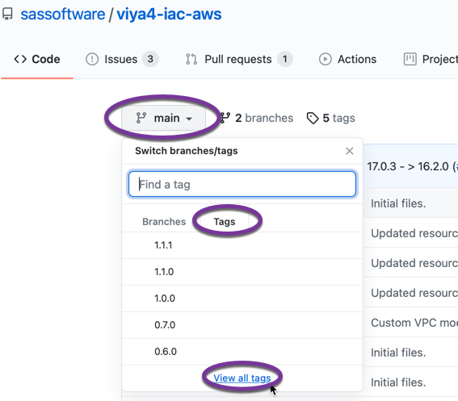

# Troubleshooting tips for SAS Viya deployment to AWS

This is not an exercise. Instead, it will be a collection of procedures to help troubleshoot and resolve unexpected challenges during the deployment of SAS Viya into AWS.

Look for problems in the following list:

- [Selecting a specific version of a Git project](#selecting-a-specific-version-of-a-git-project)
- [Bad copy & paste of long config files](#bad-copy--paste-of-long-config-files)
- [Kibana (cluster-logging) install failure](#kibana-cluster-logging-install-failure)
- [Expired AWS tokens](#expired-aws-tokens)
- [503 Service Temporarily Unavailable](#503-service-temporarily-unavailable)

## Selecting a specific version of a Git project

By default, the AWS exercises pull the "latest" versions of **viya4-iac-aws** and **viya4-deployment**. However, while this provides for the latest features and bug fixes, it can also sometimes introduce breaking changes.

If you find that you encounter unexpected errors when running the **viya4-iac-aws** and **viya4-deployment** projects, then you might want to specify a previous known-good version. Here's how.

1. In either project, click on the **main** branch pull-down menu > select the **Tags** tab > click the **View all tags** link at the bottom of the list:

   

2. Notice the dates of release for the list of version tags:

   

   If you want more information about a specific release, then click the **Releases** tab to see the release notes.

3. Select the version you want. This is where it's tricky just as if you were to encounter this problem in the real world. Generally, you want the newest version you can get *before* the breaking change you're trying to avoid.

   For this workshop, you can see the dates of the exercise files in Gitlab. So try to match up the release tag shown in Github with a date that aligns with the exercises in this workshop.

4. Tell your local Git repo to use the version of the project you want.

   ```bash
   # as cloud-user on your Linux host in RACE

   cd ~/viya4-iac-aws/        # or viya4-deployment, as needed

   # pull down all remotes
   git fetch --all

   # Identify the release/version/tag you want
   RELEASE_TAG=1.0.0

   # Switch to the release you want
   git checkout tags/${RELEASE_TAG}
   ```

5. Now that you're running on a specific version, try again to perform the step that failed unexpectedly.

## Bad copy & paste of long config files

This one is strange - and we haven't figured out the exact cause. In short, when you attempt to create a long text file using copy & paste from the text in Gitlab, some one or more arbitrary strings might be truncated. It's hard to find, but when you run a `terraform plan` or attempt to install the SAS Viya components, you'll get an error message about something being wrong. 

The simplest workaround is to copy & paste the long block of text from the Gitlab web site into a text editor *first*. Then copy & paste from the text editor to the command-line prompt in MobaXterm.

## Kibana (cluster-logging) install failure

Sometimes - not always - the `viya4-deployment` will fail when installing Kibana (i.e. the `cluster-logging` tag is specified). 

Two possible problems to consider:

1. Cannot talk to ElasticSearch
   
   Usually it complains about not being able to communicate properly with ElasticSearch similar to:

   ```log
   "INFO Pod [v4m-es-master-0] is ready...continuing.", 
   "INFO Waiting [2] minute to allow Elasticsearch to initialize", 
   "INFO Existing Open Distro release found. Skipping Elasticsearh security initialization.", 
   "INFO Open Distro for Elasticsearch has been deployed", 
   "INFO Loading Content into Elasticsearch", 
   "ERROR Unable to obtain or identify the temporary port used for port-forwarding; exiting script.", 
   "ERROR Exiting script due to an error."
   ```

   Apparently, ElasticSearch is being a little slow to fully start up. By the time you see the failure, read the error message, and find this help, it'll be ready to work. So just re-run the same `viya4-deployment` command again and it should work this time.

2. The wildcard DNS alias is not properly defined
   
   In this case, you'll see complaints about Kibana's REST endpoint not being available:

   ```log
   "INFO The Kibana pod is ready...continuing", 
   "ERROR The Kibana REST endpoint has NOT become accessible in the expected time; exiting.", 
   "ERROR Review the Kibana pod's events and log to identify the issue and resolve it before trying again."
   ```

   Revisit the instructions for creating the wildcard DNS alias and confirm everything is set properly in NAMES.na.sas.com. 

# End

This is all we have to help with troubleshooting the workshop so far. Below this point are fixes to things which should no longer be a problem.

.

.

.

.

.

.

.

.

.

.

# Corrected Problems

The following are fixes for legacy problems. Keeping them here for posterity in case they might be needed again.

## Expired AWS tokens

***[ Permanently fixed JUL-2021. New automation added to the workshop to keep AWS tokens up to date without student involvement. ]***

This workshop currently relies on the `getawskey` utility - an internal SAS project to simplify logging on to AWS. Due to role restrictions in AWS, there's a limit on how long those tokens are valid... and then they must be renewed. 

So we also use the `autorenew-getawskey` utility to keep those tokens renewed. 

But when those expire (or otherwise stop running) then your tokens will expire and this can cause unexpected behavior in the environment. 

Symptoms of expired AWS tokens include:
- Helpful error messages, like: 
  
  `An error occurred (ExpiredToken) when calling the GetCallerIdentity operation: The security token included in the request is expired`

- Confusing behavor, such as Terraform simply pausing for minutes without explaining why. Watch out for this one - it's especially obvious when trying to "show" the Terraform plan - an operation which typically requires seconds to complete.

To resolve:

- Return to the `cldlgn.fyi.sas.com` host 
- Update your kerberos tickets: `kinit`
- Re-run the `autorenew-getawskey` utility. 

Refer to the [00 001 Access Environments](/00_001_Access_Environments.md) exercise for details.

## 503 Service Temporarily Unavailable

***[ Permanently fixed JUL-2021 with SAS Viya stable/20201.1.3. ]***

So you've created your DNS alias to reach your SAS Viya cluster in AWS, but the only response you get when you try the url is: 

`503 Service Temporarily Unavailable`

HTTP 500-level messages like that means there's some problem on the backend server. And you need to be *on* the backend server to fix it. 

A new bug was introduced in stable-2020.1.5 where it's possible the SAS Cache Server has a problem with its encyrypted communication (see [NGMTS-19116](https://rndjira.sas.com/browse/NGMTS-19116?focusedCommentId=3331969&page=com.atlassian.jira.plugin.system.issuetabpanels%3Acomment-tabpanel) and [DOPL-1000](https://rndjira.sas.com/browse/DOPL-1000?jql=text%20~%20%22sas-cache%20aws%22)). This problem prevents SASLogon from working - and that pretty much stops *everything* in SAS Viya from working. 

To workaround this problem, we need to reduce the number of replicas of the SAS Cache Server that are running. Here's how:

1. Using Lens, open the list of **Stateful Sets** and find `sas-cacheserver`. 
   
2. Click on it to open the attributes tab and in the blue area at the top-right of the window, click the "pencil" icon to Edit the definition. 

3. It's a long file and we want to find the string "replicas" in the **spec:** portion of the document. Do not change the **status:** portion - if you do, Lens won't let you save the file. 

   

4. Change the value of `spec\replicas` from `2` to `1`.

5. Search for the string "_replicas" to find environment variable **SAS_CACHE_CONFIG_REPLICAS** and change that from `2` to `1`. 

   

6. Click the button to **Save**. Lens will automatically direct Kubernetes to apply the change and restart the SAS Cache Server.
   
7. Allow a few minutes for everything to get settled and try your SAS Viya web site DNS alias again.

The final fix for this problem is expected to ship with stable-2021.1.3. 
